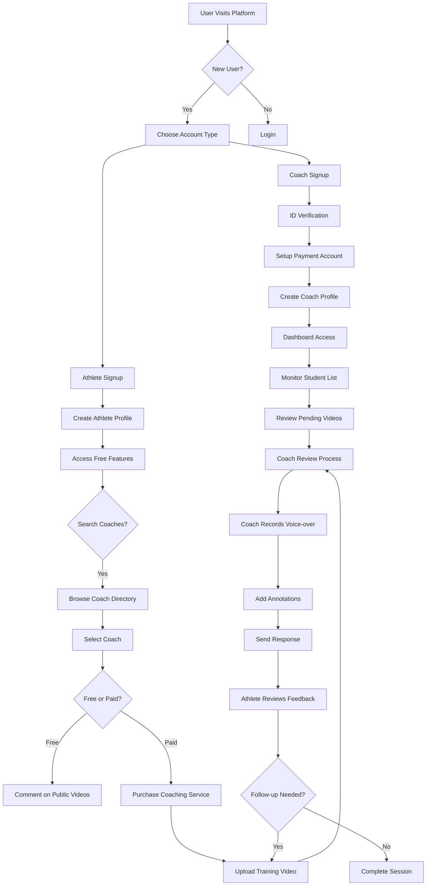
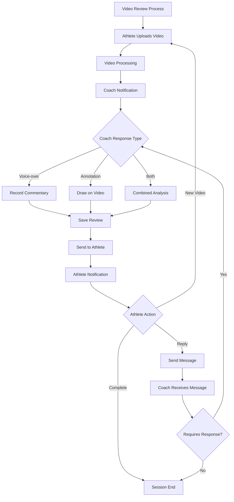
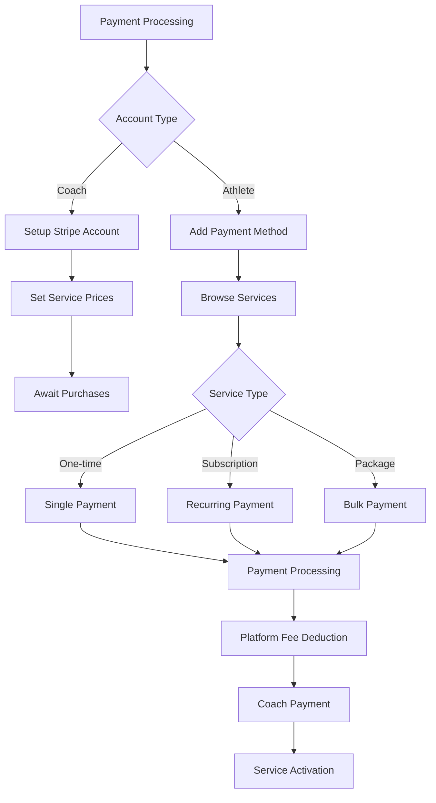
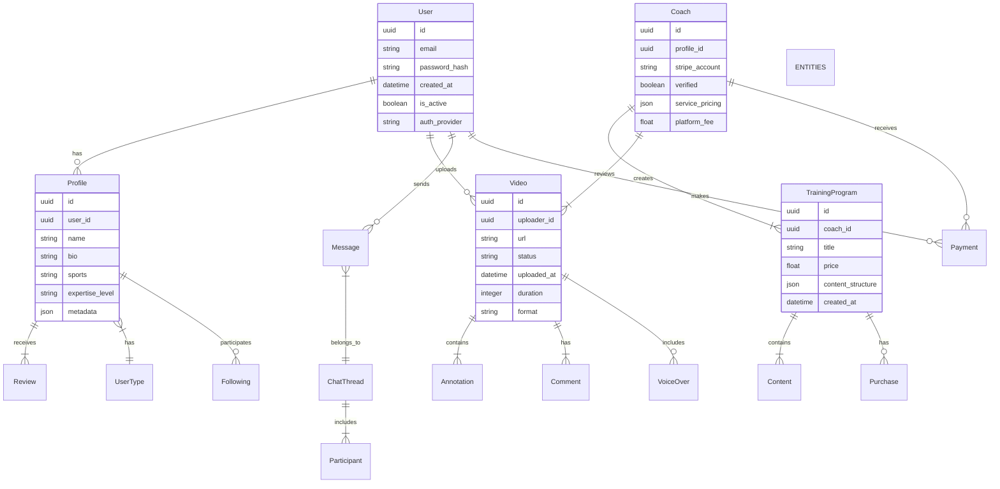
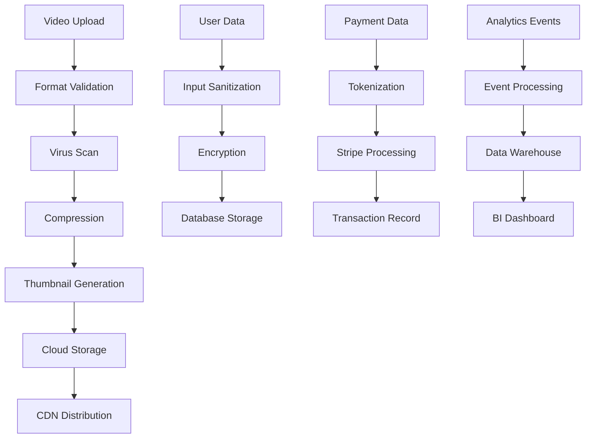

# Product Requirements Document (PRD)

# 1. INTRODUCTION

## 1.1 Purpose

This Software Requirements Specification (SRS) document provides a comprehensive description of the video coaching platform that combines personalized sports training with social networking capabilities. The document is intended for:

- Development teams implementing the platform
- Project managers overseeing development
- Stakeholders evaluating technical requirements
- QA teams designing test strategies
- UX/UI designers creating the user interface

## 1.2 Scope

The software system will deliver a mobile-first platform that enables coaches to provide remote video analysis and training to athletes worldwide. The platform encompasses:

- Dual-interface system (coach and athlete portals)
- Video upload and analysis tools with annotation capabilities
- Direct messaging and communication features
- Monetization system for coaching services
- Training content marketplace
- Social networking features for the sports community

Key Benefits:
- Enables coaches to scale their business globally
- Provides athletes access to elite coaching regardless of location
- Creates recurring revenue streams for coaches
- Facilitates community building among athletes and coaches
- Streamlines the remote coaching process through integrated tools

Core Functionalities:
- Video analysis with voice-over recording
- Real-time annotation tools
- Secure payment processing
- Direct messaging system
- Content management for training programs
- Coach discovery and matching algorithm
- Profile management for coaches and athletes
- Video storage and processing
- Social networking features

# 2. PRODUCT DESCRIPTION

## 2.1 Product Perspective

The video coaching platform operates as a standalone mobile-first application that integrates with several external systems:

- Payment processing through Stripe
- Cloud storage for video content
- Authentication services via Auth0
- Social media platforms for login integration
- Video compression and streaming services

The system architecture follows a client-server model with:
- Native mobile applications for iOS and Android
- Web application for desktop access
- RESTful API backend infrastructure
- Real-time messaging and notification services
- Secure cloud database storage

## 2.2 Product Functions

The platform provides these core functions:

| Function Category | Key Features |
|------------------|--------------|
| Video Management | - Video upload/recording - Real-time annotation tools - Voice-over recording - Slow-motion playback |
| Coaching Tools | - Video analysis workspace - Training program creation - Digital product management - Student progress tracking |
| Communication | - Direct messaging - Group messaging - Video response system - Notification center |
| Marketplace | - Coach discovery algorithm - Training program store - Digital product sales - Subscription management |
| Social Features | - User profiles - Activity feeds - Community engagement - Following system |

## 2.3 User Characteristics

### Coaches
- Professional sports trainers and instructors
- Experience level ranges from certified professionals to elite athletes
- Tech-savvy enough to use video tools
- Age range: 25-65
- Seeking to expand their coaching business online

### Athletes
- Amateur to semi-professional athletes
- Various skill levels from beginner to advanced
- Mobile-first users comfortable with social media
- Age range: 16-45
- Seeking personalized training and improvement

## 2.4 Constraints

Technical Constraints:
- Video file size limits: 500MB per upload
- Storage retention: 90 days for inactive users
- Supported video formats: .mp4, .mov, .h264, .flv
- Minimum internet speed requirement: 5Mbps upload/download

Legal Constraints:
- Coach background verification requirements
- Data privacy compliance (GDPR, CCPA)
- Minor protection policies
- Payment processing regulations

Business Constraints:
- Platform fee structure limitations
- Geographic restrictions for certain payment methods
- Coach-to-athlete ratio limits for quality maintenance

## 2.5 Assumptions and Dependencies

Assumptions:
- Users have access to smartphones with cameras
- Coaches have basic technical proficiency
- Stable internet connectivity for video uploads
- Market demand for remote coaching services
- Users accept cloud storage of their content

Dependencies:
- Stripe payment processing availability
- Cloud service provider uptime
- Auth0 authentication services
- Mobile app store approvals
- Video processing service reliability
- Social media API availability for integration
- Background check service availability

# 3. PROCESS FLOWCHART

# 4. FUNCTIONAL REQUIREMENTS

## 4.1 Video Management System

### ID: F001
### Description: Core video upload, processing, and playback functionality
### Priority: High

| Requirement ID | Requirement Description | Acceptance Criteria |
|----------------|------------------------|-------------------|
| F001.1 | Support video upload in formats: .mp4, .mov, .h264, .flv | - All specified formats successfully upload - Automatic format validation - Error messaging for unsupported formats |
| F001.2 | Video compression and processing | - Maintain quality while reducing file size - Process videos under 30 seconds - Support files up to 500MB |
| F001.3 | Playback controls | - Play/pause functionality - Speed control (0.25x to 2x) - Frame-by-frame navigation - Full-screen mode |
| F001.4 | Video storage management | - 90-day retention for inactive users - Permanent storage for active subscriptions - Automatic cleanup of expired content |

## 4.2 Coaching Tools

### ID: F002
### Description: Video analysis and annotation capabilities
### Priority: High

| Requirement ID | Requirement Description | Acceptance Criteria |
|----------------|------------------------|-------------------|
| F002.1 | Voice-over recording | - Synchronized audio recording - Pause/resume capability - Audio waveform visualization |
| F002.2 | Drawing tools | - Free-hand drawing - Straight lines - Arrows - Shapes (circles, rectangles) - Body part highlighting |
| F002.3 | Annotation persistence | - Save annotations with timestamp - Edit existing annotations - Delete annotations |
| F002.4 | Analysis workspace | - Split-screen comparison - Multiple angle viewing - Measurement tools |

## 4.3 Communication System

### ID: F003
### Description: Messaging and notification functionality
### Priority: High

| Requirement ID | Requirement Description | Acceptance Criteria |
|----------------|------------------------|-------------------|
| F003.1 | Direct messaging | - Text messages - Video sharing - Image sharing - Read receipts |
| F003.2 | Group messaging | - Create groups - Add/remove members - Admin controls |
| F003.3 | Notification system | - Push notifications - In-app alerts - Email notifications - Custom notification preferences |
| F003.4 | Message organization | - Separate sections for active students, one-off reviews, and inquiries - Search functionality - Message threading |

## 4.4 Marketplace System

### ID: F004
### Description: Coach discovery and monetization features
### Priority: High

| Requirement ID | Requirement Description | Acceptance Criteria |
|----------------|------------------------|-------------------|
| F004.1 | Coach discovery | - Search filters by sport, location, price - Rating system - Review system - Algorithmic ranking |
| F004.2 | Payment processing | - Stripe integration - Multiple payment methods - Automated platform fee collection - Refund handling |
| F004.3 | Product management | - Digital product creation - Pricing configuration - Bundle creation - Subscription management |
| F004.4 | Transaction tracking | - Revenue dashboard - Payment history - Earnings reports - Tax documentation |

## 4.5 Profile Management

### ID: F005
### Description: User profile and account management
### Priority: High

| Requirement ID | Requirement Description | Acceptance Criteria |
|----------------|------------------------|-------------------|
| F005.1 | Coach profiles | - Bio and credentials - Portfolio upload - Service pricing - Availability settings |
| F005.2 | Athlete profiles | - Sports preferences - Skill level - Training history - Goals tracking |
| F005.3 | Account settings | - Password management - Payment methods - Notification preferences - Privacy settings |
| F005.4 | Verification system | - ID verification - Background check integration - Credential validation - Profile approval process |

## 4.6 Content Management

### ID: F006
### Description: Training content and resource management
### Priority: Medium

| Requirement ID | Requirement Description | Acceptance Criteria |
|----------------|------------------------|-------------------|
| F006.1 | Training programs | - Course creation tools - Content organization - Progress tracking - Access management |
| F006.2 | Resource library | - PDF upload/management - Video library organization - Content categorization - Search functionality |
| F006.3 | Content delivery | - Scheduled releases - Access levels - Download options - Streaming optimization |
| F006.4 | Analytics | - View counts - Engagement metrics - Revenue tracking - User feedback |

# 5. NON-FUNCTIONAL REQUIREMENTS

## 5.1 Performance Requirements

| Requirement | Specification | Measurement |
|------------|---------------|-------------|
| Page Load Time | < 3 seconds | 95th percentile under normal load |
| Video Upload | < 30 seconds for 500MB | 90th percentile with 5Mbps connection |
| Video Processing | < 60 seconds | For standard HD video compression |
| API Response Time | < 200ms | 95th percentile for non-video endpoints |
| Concurrent Users | 10,000 minimum | Without performance degradation |
| Database Queries | < 100ms | 95th percentile for standard operations |
| Real-time Messaging | < 500ms latency | End-to-end message delivery |

## 5.2 Safety Requirements

| Requirement | Implementation |
|------------|----------------|
| Data Backup | - Automated daily backups - Point-in-time recovery up to 30 days - Geographic redundancy |
| Failure Recovery | - Automatic failover systems - Hot standby servers - Data center redundancy |
| Error Handling | - Graceful degradation of services - User-friendly error messages - Automated error reporting |
| Content Safety | - Automated content moderation - Manual review process for flagged content - Emergency content takedown capability |

## 5.3 Security Requirements

| Category | Requirements |
|----------|--------------|
| Authentication | - Multi-factor authentication - Biometric login support - Session management - Auth0 integration |
| Authorization | - Role-based access control - Granular permissions system - API key management |
| Data Protection | - End-to-end encryption for messages - At-rest encryption for stored data - TLS 1.3 for all connections |
| Privacy | - GDPR compliance tools - Data anonymization - Privacy policy enforcement - User consent management |

## 5.4 Quality Requirements

### 5.4.1 Availability
- 99.9% uptime guarantee
- Maximum planned downtime: 4 hours/month
- Unplanned downtime resolution: < 1 hour

### 5.4.2 Maintainability
- Modular architecture
- Comprehensive API documentation
- Automated deployment pipeline
- Version control with Git
- Code coverage > 80%

### 5.4.3 Usability
- Mobile-first responsive design
- Maximum 3 clicks to core functions
- Accessibility compliance (WCAG 2.1)
- Multi-language support
- Intuitive UI with consistent patterns

### 5.4.4 Scalability
- Horizontal scaling capability
- Auto-scaling based on load
- Microservices architecture
- CDN integration for content delivery
- Database sharding support

### 5.4.5 Reliability
- Mean Time Between Failures (MTBF): > 720 hours
- Mean Time To Recovery (MTTR): < 1 hour
- Zero data loss guarantee
- Automated system health checks
- Regular disaster recovery testing

## 5.5 Compliance Requirements

| Requirement | Description |
|------------|-------------|
| Data Privacy | - GDPR compliance - CCPA compliance - COPPA compliance for minors |
| Financial | - PCI DSS compliance for payments - SOC 2 Type II certification - Local tax regulations |
| Sports Industry | - Sport-specific governing body regulations - Coach certification verification - Background check requirements |
| Technical Standards | - OAuth 2.0 for authentication - REST API standards - WebRTC for real-time communication - H.264 video codec support |

# 6. DATA REQUIREMENTS

## 6.1 Data Models

## 6.2 Data Storage

### 6.2.1 Primary Storage
- User data: PostgreSQL database cluster
- Video content: Cloud object storage (S3-compatible)
- Real-time messages: Redis clusters
- Search indexes: Elasticsearch

### 6.2.2 Data Retention
| Data Type | Retention Period | Storage Location |
|-----------|-----------------|------------------|
| User Profiles | Indefinite | PostgreSQL |
| Active User Videos | Indefinite | Cloud Storage |
| Inactive User Videos | 90 days | Cloud Storage |
| Chat History | 1 year | PostgreSQL/Redis |
| Payment Records | 7 years | PostgreSQL |
| System Logs | 30 days | ELK Stack |

### 6.2.3 Backup Strategy
- Daily incremental backups of PostgreSQL databases
- Weekly full backups of all data
- Cross-region replication for cloud storage
- Point-in-time recovery capability for last 30 days
- Automated backup testing monthly

## 6.3 Data Processing

### 6.3.1 Security Measures
- AES-256 encryption for data at rest
- TLS 1.3 for data in transit
- PII data encryption with separate key management
- Role-based access control (RBAC)
- Regular security audits and penetration testing

### 6.3.2 Data Processing Requirements
| Process Type | SLA | Scale Requirements |
|-------------|-----|-------------------|
| Video Processing | < 60s | 1000 concurrent uploads |
| Payment Processing | < 3s | 10,000 TPS |
| Search Indexing | < 30s | 1M documents/hour |
| Analytics Processing | < 5m | 100M events/day |

### 6.3.3 Data Integration
- REST API endpoints for third-party integrations
- Webhook support for real-time events
- Batch processing for analytics data
- ETL pipelines for reporting systems

### 6.3.4 Data Quality
- Input validation on all user-submitted data
- Automated data consistency checks
- Data cleansing pipelines
- Regular data quality audits
- Duplicate detection and merging

# 7. EXTERNAL INTERFACES

## 7.1 User Interfaces

### 7.1.1 Mobile Application Interface

| Interface Component | Requirements |
|-------------------|--------------|
| Video Recording Screen | - Camera access controls - Recording timer - Quality settings - Upload progress indicator |
| Video Review Workspace | - Split-screen capability - Annotation toolbar - Voice-over controls - Playback controls |
| Coach Dashboard | - Active student list - Pending reviews queue - Revenue metrics - Notification center |
| Athlete Dashboard | - Coach discovery - Training progress - Video library - Message center |

### 7.1.2 Web Application Interface

| Interface Component | Requirements |
|-------------------|--------------|
| Video Analysis Tools | - Multi-monitor support - Keyboard shortcuts - Enhanced annotation tools - Side-by-side comparison |
| Content Management | - Drag-and-drop uploads - Bulk operations - Content organization tools - Preview capabilities |
| Admin Panel | - User management - Content moderation - Analytics dashboard - System configuration |

## 7.2 Hardware Interfaces

### 7.2.1 Mobile Device Requirements

| Component | Specification |
|-----------|--------------|
| Camera | - Minimum 720p video capture - 30fps recording capability - Auto-focus support |
| Storage | - Minimum 1GB free space - External storage support |
| Processor | - ARMv8 64-bit or equivalent - Minimum 2GHz clock speed |
| Memory | - Minimum 2GB RAM for video processing |

### 7.2.2 Sensor Integration

| Sensor Type | Requirements |
|-------------|--------------|
| Accelerometer | - Motion tracking for form analysis - 100Hz minimum sampling rate |
| Gyroscope | - Rotation detection for 3D movement analysis - Angular velocity measurement |
| GPS | - Location tracking for outdoor activities - Accuracy within 5 meters |

## 7.3 Software Interfaces

### 7.3.1 External Services Integration

| Service | Interface Requirements |
|---------|----------------------|
| Auth0 | - OAuth 2.0 protocol - JWT token handling - Social login providers |
| Stripe | - Payment API v2021-11-15 or later - Webhook integration - Connect platform integration |
| AWS S3 | - Direct upload integration - CloudFront CDN distribution - Cross-region replication |
| Firebase | - Real-time database integration - Push notification service - Analytics integration |

### 7.3.2 Video Processing Services

| Service | Requirements |
|---------|--------------|
| FFmpeg | - H.264 encoding support - Frame extraction capability - Format conversion |
| Media Processing | - Cloud-based transcoding - Adaptive bitrate streaming - Thumbnail generation |

## 7.4 Communication Interfaces

### 7.4.1 Network Protocols

| Protocol | Requirements |
|----------|--------------|
| HTTPS | - TLS 1.3 support - Certificate pinning - HSTS implementation |
| WebSocket | - Secure WebSocket (WSS) - Auto-reconnection - Message queuing |
| WebRTC | - Peer-to-peer video streaming - NAT traversal - Connection fallback |

### 7.4.2 API Specifications

| API Type | Requirements |
|----------|--------------|
| REST API | - JSON payload format - Rate limiting - Versioning support |
| GraphQL | - Real-time subscriptions - Schema validation - Query complexity limits |
| Webhook Events | - Retry mechanism - Event signature validation - Delivery confirmation |

### 7.4.3 Data Exchange Formats

| Format | Specifications |
|--------|---------------|
| JSON | - UTF-8 encoding - Schema validation - Compression support |
| Binary | - Protocol buffers support - MessagePack encoding - Custom binary formats |
| Media | - HLS streaming format - DASH streaming support - Progressive download |

# 8. APPENDICES

## 8.1 GLOSSARY

| Term | Definition |
|------|------------|
| Voice-over Recording | Real-time audio commentary recorded while watching a video |
| Annotation Tools | Drawing and markup capabilities that overlay on video content |
| Platform Fee | Percentage or fixed amount charged by the platform for each transaction |
| Training Program | Structured collection of videos, PDFs, and resources created by coaches |
| One-Off Review | Single video analysis session without ongoing commitment |
| Cohort | Group of athletes participating in a shared training program |
| Video Analysis Workspace | Interface where coaches can review and annotate athlete videos |
| Student List | Collection of athletes actively receiving coaching from a specific coach |
| Digital Product | Downloadable or streaming content created by coaches for sale |

## 8.2 ACRONYMS

| Acronym | Expansion |
|---------|-----------|
| API | Application Programming Interface |
| AR | Augmented Reality |
| CDN | Content Delivery Network |
| CSV | Comma-Separated Values |
| DASH | Dynamic Adaptive Streaming over HTTP |
| DM | Direct Message |
| HLS | HTTP Live Streaming |
| JWT | JSON Web Token |
| NAT | Network Address Translation |
| PDF | Portable Document Format |
| REST | Representational State Transfer |
| TPS | Transactions Per Second |
| UI/UX | User Interface/User Experience |
| WSS | WebSocket Secure |

## 8.3 ADDITIONAL REFERENCES

### 8.3.1 Technical Standards
- WebRTC Standards: https://webrtc.org/getting-started/overview
- OAuth 2.0 Specification: https://oauth.net/2/
- H.264 Video Coding Standard: https://www.itu.int/rec/T-REC-H.264

### 8.3.2 Similar Platforms
- CoachNow: https://coachnow.io/
- Cameo: https://www.cameo.com/
- OnlyFans: https://onlyfans.com/

### 8.3.3 Development Resources
- Stripe API Documentation: https://stripe.com/docs/api
- Auth0 Implementation Guide: https://auth0.com/docs/
- AWS S3 Best Practices: https://docs.aws.amazon.com/AmazonS3/latest/userguide/best-practices.html
- Firebase Documentation: https://firebase.google.com/docs

### 8.3.4 Industry Guidelines
- Sports Coach UK Code of Practice
- International Sport Coaching Framework
- Digital Coaching Best Practices
- Video Analysis Methodology Guidelines

## 8.4 REVISION HISTORY

| Version | Date | Description | Author |
|---------|------|-------------|---------|
| 1.0 | Initial | First draft of complete PRD | - |
| 1.1 | - | Added external interfaces section | - |
| 1.2 | - | Updated data requirements | - |
| 1.3 | - | Added appendices | - |