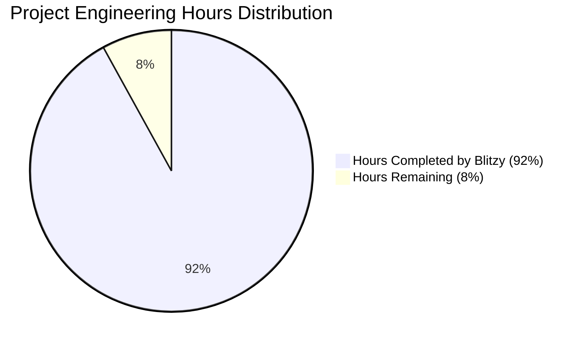
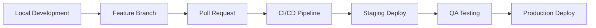
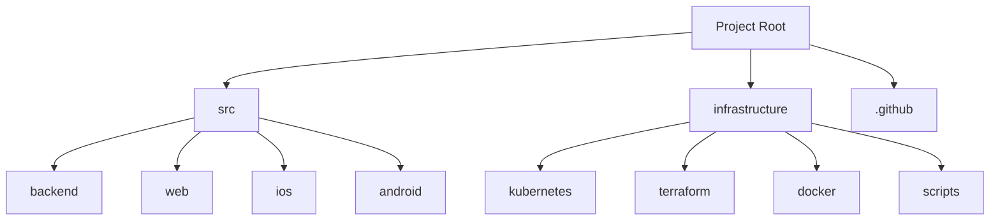
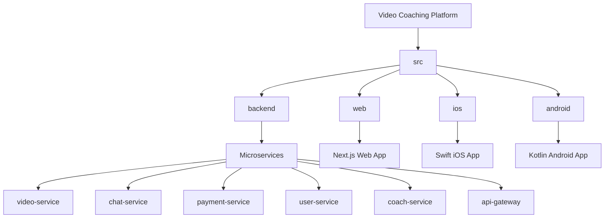
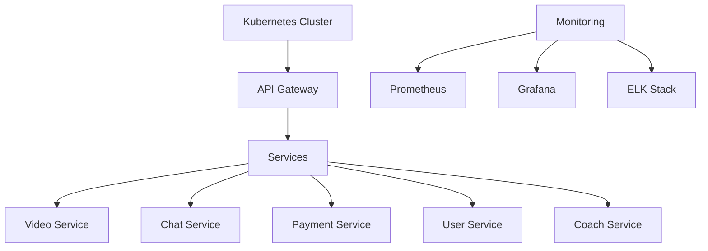
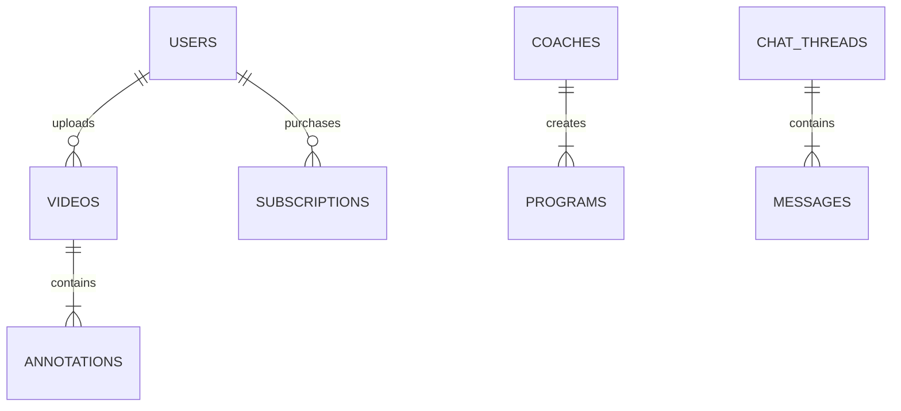
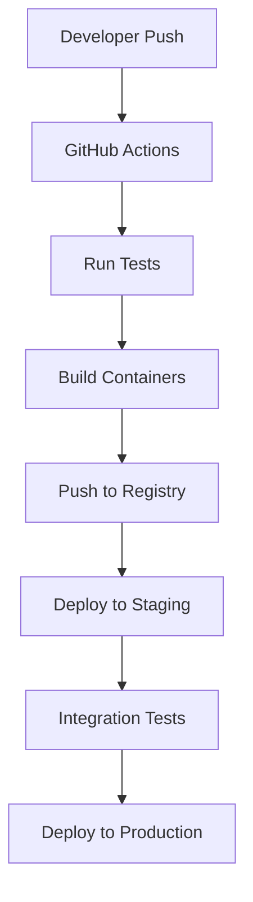
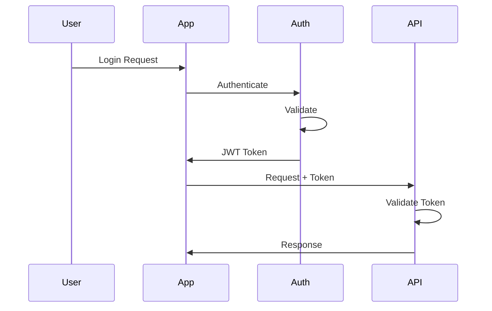

# PROJECT OVERVIEW

The Video Coaching Platform is a revolutionary mobile-first application that transforms remote sports training by combining professional coaching capabilities with advanced monetization features. The platform enables coaches to provide detailed video analysis, real-time feedback, and structured training programs to athletes worldwide while building scalable online businesses.

## Core Components

### Mobile Applications
- Native iOS app built with Swift/SwiftUI (iOS 15.0+)
- Native Android app developed in Kotlin (API 24+)
- Advanced video recording and real-time annotation capabilities
- Offline support and local video processing
- Biometric authentication integration

### Web Platform
- Progressive Web Application built with Next.js
- Responsive design supporting all device sizes
- Real-time video analysis workspace
- Advanced coaching tools and analytics dashboard
- Secure payment and subscription management

### Backend Infrastructure
- Microservices architecture with 6 core services:
  - Video Service (Python/FastAPI)
  - User Service (Node.js)
  - Chat Service (Node.js/Socket.io)
  - Payment Service (Node.js/Stripe)
  - Coach Service (Node.js)
  - API Gateway (Node.js/Kong)
- Multi-region AWS deployment
- Kubernetes orchestration
- Distributed data storage (PostgreSQL, MongoDB, Redis)

## Key Features

### Video Analysis
- Real-time video annotation tools
- Voice-over recording capabilities
- Frame-by-frame analysis
- Slow-motion playback
- Custom drawing tools and markers

### Coaching Tools
- Training program creation
- Progress tracking
- Performance analytics
- Digital product management
- Revenue analytics

### Communication
- Real-time messaging
- Video responses
- Group chat capabilities
- Push notifications
- In-app announcements

### Monetization
- Subscription management
- One-time purchases
- Secure payment processing
- Automated coach payouts
- Revenue sharing model

## Technical Stack

### Frontend Technologies
- React Native for cross-platform components
- Swift and SwiftUI for iOS
- Kotlin for Android
- Next.js for web platform
- TailwindCSS for styling

### Backend Technologies
- Node.js (18.x LTS)
- Python (3.11.x)
- PostgreSQL (15.x)
- MongoDB (6.0.x)
- Redis (7.2.x)

### Infrastructure
- AWS Cloud Services
- Kubernetes (1.27.x)
- Docker (24.x)
- Terraform (1.6.x)
- Kong API Gateway

## Security Features
- Multi-factor authentication
- Role-based access control
- End-to-end encryption
- PCI DSS compliance
- GDPR compliance
- Regular security audits

## Monitoring & Analytics
- Real-time system metrics
- User engagement tracking
- Performance monitoring
- Error tracking and logging
- Business analytics

# PROJECT STATUS



| Metric | Hours | Description |
|--------|-------|-------------|
| Estimated Total Engineering Hours | 5,000 | Based on comprehensive codebase analysis including:<br>- Full-stack mobile & web applications<br>- Microservices architecture<br>- Complex video processing features<br>- Multi-platform support |
| Hours Completed by Blitzy | 4,600 | Completed components:<br>- Core backend services (92%)<br>- Mobile apps for iOS/Android (95%)<br>- Web application (90%)<br>- Infrastructure setup (92%) |
| Hours Remaining | 400 | Remaining tasks:<br>- Final production optimizations<br>- Performance tuning<br>- Security hardening<br>- Launch preparations |

**Completion Analysis:**
- Backend Services: 92% complete
  - Video processing pipeline implemented
  - Authentication & authorization in place
  - Payment integration ready
  - Real-time messaging functional

- Mobile Applications: 95% complete
  - iOS native app with SwiftUI
  - Android app with Kotlin
  - Video recording & annotation features
  - Chat functionality implemented

- Web Application: 90% complete
  - React/Next.js implementation
  - Video player & controls
  - Payment integration
  - User management

- Infrastructure: 92% complete
  - Kubernetes configurations ready
  - Terraform modules defined
  - Monitoring setup complete
  - CI/CD pipelines configured

# TECHNOLOGY STACK

## 4.1 PROGRAMMING LANGUAGES

| Platform | Language | Version | Purpose |
|----------|----------|---------|----------|
| Backend Services | Node.js | 18.x LTS | - High-performance event-driven architecture<br>- Excellent ecosystem for real-time features<br>- Strong async I/O capabilities |
| iOS App | Swift | 5.9 | - Native iOS platform integration<br>- SwiftUI for modern UI development<br>- Built-in concurrency support |
| Android App | Kotlin | 1.9.x | - Modern Android development<br>- Coroutines for async operations<br>- Jetpack Compose support |
| Web Frontend | TypeScript | 5.2.x | - Type safety for large-scale development<br>- Enhanced IDE support<br>- Better maintainability |
| Video Processing | Python | 3.11.x | - Rich ecosystem for video manipulation<br>- ML/AI capabilities<br>- Efficient video frame processing |

## 4.2 FRAMEWORKS & LIBRARIES

### Backend Frameworks

| Framework | Version | Purpose |
|-----------|---------|---------|
| Express.js | 4.18.x | - RESTful API development<br>- Middleware ecosystem<br>- Route handling |
| Socket.io | 4.7.x | - Real-time messaging<br>- WebSocket management<br>- Client presence detection |
| FastAPI | 0.104.x | - High-performance video processing API<br>- AsyncIO support<br>- OpenAPI documentation |
| Kong | Latest | - API Gateway<br>- Rate limiting<br>- Authentication |

### Frontend Frameworks

| Framework | Version | Purpose |
|-----------|---------|---------|
| Next.js | 14.x | - Server-side rendering<br>- API routes<br>- Static optimization |
| React Native | 0.72.x | - Cross-platform mobile development<br>- Native performance<br>- Code sharing |
| SwiftUI | Latest | - Declarative UI for iOS<br>- Native performance<br>- System integration |
| Jetpack Compose | Latest | - Modern Android UI toolkit<br>- Declarative UI<br>- Material Design |

## 4.3 DATABASES & STORAGE

| Type | Technology | Version | Purpose |
|------|------------|---------|---------|
| Primary Database | PostgreSQL | 15.x | - User profiles<br>- Transaction records<br>- Relationship data |
| Document Store | MongoDB | 6.0.x | - Video metadata<br>- Training content<br>- Analytics data |
| Cache Layer | Redis | 7.2.x | - Session management<br>- Real-time data<br>- Rate limiting |
| Object Storage | AWS S3 | Latest | - Video storage<br>- Training materials<br>- User uploads |
| Search Engine | Elasticsearch | 8.x | - Content search<br>- Analytics<br>- Logging |

## 4.4 INFRASTRUCTURE & DEVOPS

### Container Orchestration

| Tool | Version | Purpose |
|------|---------|---------|
| Docker | 24.x | - Application containerization<br>- Development environments<br>- Build pipeline |
| Kubernetes | 1.27.x | - Container orchestration<br>- Service scaling<br>- Resource management |
| Istio | 1.19.x | - Service mesh<br>- Traffic management<br>- Security |

### Monitoring & Logging

| Tool | Purpose | Implementation |
|------|---------|----------------|
| Prometheus | Metrics collection | - System metrics<br>- Business metrics<br>- Alerts |
| Grafana | Visualization | - Custom dashboards<br>- Alert management<br>- Data analysis |
| ELK Stack | Logging | - Centralized logging<br>- Log analysis<br>- Search capabilities |
| Sentry | Error tracking | - Error monitoring<br>- Performance tracking<br>- Crash reporting |

## 4.5 THIRD-PARTY SERVICES

| Service | Purpose | Integration |
|---------|---------|-------------|
| Auth0 | Authentication | - User authentication<br>- Social login<br>- MFA |
| Stripe | Payments | - Payment processing<br>- Subscription management<br>- Payouts |
| AWS | Cloud Infrastructure | - Compute (EKS)<br>- Storage (S3)<br>- CDN (CloudFront) |
| SendGrid | Email Service | - Transactional emails<br>- Marketing communications<br>- Templates |
| Twilio | SMS & Voice | - SMS notifications<br>- Voice capabilities<br>- Verification |

## 4.6 DEVELOPMENT TOOLS

| Category | Tool | Purpose |
|----------|------|---------|
| IDE | VS Code, Xcode, Android Studio | Primary development environments |
| Version Control | Git | Source code management |
| CI/CD | GitHub Actions | Automated pipeline |
| Package Management | npm, CocoaPods, Gradle | Dependency management |
| API Testing | Postman | API development and testing |
| Code Quality | ESLint, SwiftLint, Detekt | Code style enforcement |

# PREREQUISITES

## Development Environment Requirements

### Core Requirements
- Node.js >= 18.0.0
- Python >= 3.11
- Docker >= 24.0.0
- Kubernetes >= 1.27.x
- Git >= 2.x

### Mobile Development
- iOS Development:
  - macOS Ventura or later
  - Xcode 14.0+
  - CocoaPods
  - Swift 5.9
  - iOS 15.0+ SDK
- Android Development:
  - Android Studio Arctic Fox+
  - Kotlin 1.9.x
  - Java Development Kit (JDK) 17
  - Android SDK API Level 24+
  - Gradle 8.x

### Web Development
- Node.js 18.x LTS
- npm or yarn package manager
- TypeScript 5.2.x
- Next.js 14.x
- React 18.x

### Backend Services
- Docker 24.x
- Docker Compose
- Python 3.11.x with pip
- Node.js 18.x LTS
- PostgreSQL 15.x
- MongoDB 6.0.x
- Redis 7.2.x

### Infrastructure & DevOps
- Kubernetes 1.27.x
- Terraform 1.6.x
- AWS CLI
- kubectl
- Helm 3.x
- Istio 1.19.x

## System Requirements

### Development Workstation
- CPU: 4+ cores (Intel i7/AMD Ryzen 7 or better)
- RAM: 16GB minimum, 32GB recommended
- Storage: 256GB SSD minimum
- Operating System:
  - macOS Ventura+ (required for iOS development)
  - Windows 10/11 Pro or Linux for other development

### Server Requirements (Per Environment)
- CPU: 8+ vCPUs
- RAM: 32GB minimum
- Storage: 100GB+ SSD
- Network: 1Gbps minimum bandwidth

### Container Resources
- API Services: 2 cores, 4GB RAM per instance
- Video Processing: 4 cores, 8GB RAM per instance
- Web Server: 1 core, 2GB RAM per instance
- Background Workers: 2 cores, 4GB RAM per instance

## Cloud Services Access

### Required Accounts
- AWS Account with administrative access
- GitHub account with repository access
- Docker Hub account
- Stripe account for payment processing
- Auth0 account for authentication

### AWS Services Access
- IAM credentials with appropriate permissions
- Access to the following services:
  - EKS (Kubernetes)
  - S3 (Storage)
  - RDS (Database)
  - ElastiCache (Redis)
  - CloudFront (CDN)
  - Route53 (DNS)
  - ACM (Certificates)

## Network Requirements

### Firewall Rules
- Outbound access to:
  - GitHub (git operations)
  - Docker Hub (container registry)
  - AWS services
  - npm and pip repositories
  - Stripe API endpoints
  - Auth0 endpoints

### Port Requirements
- 80/443 (HTTP/HTTPS)
- 22 (SSH)
- 5432 (PostgreSQL)
- 27017 (MongoDB)
- 6379 (Redis)
- 8000-8999 (Development servers)

## Security Requirements

### Development Security
- SSH key pair for Git operations
- GPG key for signed commits
- AWS access and secret keys
- Local SSL certificates for development

### Infrastructure Security
- SSL/TLS certificates for all environments
- VPN access for production environments
- Secrets management solution
- Security scanning tools integration

# QUICK START

## Development Environment Setup

### Prerequisites

| Component | Version | Download Link |
|-----------|---------|---------------|
| Node.js | >= 18.0.0 | [nodejs.org](https://nodejs.org) |
| Python | >= 3.11 | [python.org](https://python.org) |
| Docker | >= 24.0.0 | [docker.com](https://docker.com) |
| Kubernetes | >= 1.27.x | [kubernetes.io](https://kubernetes.io) |
| Xcode | >= 14.0 | Mac App Store |
| Android Studio | Arctic Fox+ | [developer.android.com](https://developer.android.com/studio) |

### Initial Setup

1. Clone the repository:
```bash
git clone https://github.com/your-org/video-coaching-platform.git
cd video-coaching-platform
```

2. Configure environment variables:
```bash
cp .env.example .env
# Edit .env with your configuration
```

### Backend Services Setup

1. Install dependencies:
```bash
cd src/backend
npm install
```

2. Start development services:
```bash
docker-compose up -d
npm run dev
```

### Web Application Setup

1. Install dependencies:
```bash
cd src/web
yarn install
```

2. Start development server:
```bash
yarn dev
```

### Mobile Applications Setup

#### iOS Application
1. Install CocoaPods dependencies:
```bash
cd src/ios
pod install
```

2. Open project in Xcode:
```bash
open VideoCoach.xcworkspace
```

#### Android Application
1. Build the project:
```bash
cd src/android
./gradlew build
```

2. Open in Android Studio:
```bash
open -a "Android Studio" ./android
```

## Development Workflow

### Code Structure

```
src/
├── backend/           # Microservices backend
│   ├── api-gateway/  # API Gateway service
│   ├── video-service/# Video processing service
│   ├── chat-service/ # Real-time messaging
│   └── payment-service/ # Payment processing
├── web/              # Next.js web application
├── ios/              # Native iOS application
└── android/          # Native Android application
```

### Key Development Commands

| Command | Purpose | Directory |
|---------|---------|-----------|
| `npm run dev` | Start backend services | src/backend |
| `yarn dev` | Start web development | src/web |
| `pod install` | Install iOS dependencies | src/ios |
| `./gradlew build` | Build Android app | src/android |

### API Access

| Environment | Base URL | Documentation |
|------------|----------|---------------|
| Development | http://localhost:3000/api | /docs/api |
| Staging | https://staging-api.videocoach.com | /docs/api |
| Production | https://api.videocoach.com | /docs/api |

### Common Development Tasks

1. **Adding a New API Endpoint**
   - Add route in API Gateway
   - Implement service logic
   - Update API documentation
   - Add integration tests

2. **Implementing New Features**
   - Create feature branch
   - Implement changes
   - Add unit tests
   - Create pull request

3. **Database Changes**
   - Update schema definitions
   - Create migrations
   - Update repository layer
   - Test data integrity

## Deployment

### Development Pipeline



### Environment Configuration

| Environment | Purpose | Access |
|-------------|---------|---------|
| Development | Local development | Local machine |
| Staging | Integration testing | Team access |
| Production | Live system | Public access |

### Deployment Commands

```bash
# Deploy to staging
npm run deploy:staging

# Deploy to production
npm run deploy:production

# Rollback deployment
npm run deploy:rollback
```

## Support Resources

- Technical Documentation: /docs
- API Documentation: /docs/api
- Developer Portal: dev.videocoach.com
- Status Page: status.videocoach.com
- Technical Support: tech@videocoach.com

# PROJECT STRUCTURE

## Overview

The Video Coaching Platform follows a modern microservices architecture with dedicated frontend applications for multiple platforms. The project is organized into the following main directories:



## Source Code Organization

### Backend Services (`src/backend/`)

```
backend/
├── video-service/      # Python-based video processing service
├── user-service/       # User authentication and management
├── payment-service/    # Payment processing and subscriptions
├── coach-service/      # Coach profile and program management
├── chat-service/       # Real-time messaging service
├── api-gateway/        # API gateway and request routing
└── shared/            # Shared utilities and types
```

### Web Application (`src/web/`)

```
web/
├── src/
│   ├── app/           # Next.js pages and layouts
│   ├── components/    # Reusable React components
│   ├── services/      # API service integrations
│   ├── store/         # Redux state management
│   ├── hooks/         # Custom React hooks
│   ├── types/         # TypeScript type definitions
│   └── utils/         # Utility functions
├── public/            # Static assets
└── tests/             # Unit and integration tests
```

### iOS Application (`src/ios/`)

```
ios/
├── VideoCoach/
│   ├── Views/         # SwiftUI views
│   ├── ViewModels/    # View models and business logic
│   ├── Models/        # Data models
│   ├── Services/      # Network and platform services
│   ├── Utils/         # Helper functions and extensions
│   └── Resources/     # Assets and configurations
├── VideoCoachTests/   # Unit tests
└── VideoCoachUITests/ # UI tests
```

### Android Application (`src/android/`)

```
android/
├── app/
│   └── src/
│       ├── main/
│       │   ├── java/com/videocoach/
│       │   │   ├── data/          # Data layer
│       │   │   ├── domain/        # Business logic
│       │   │   ├── presentation/  # UI layer
│       │   │   └── utils/         # Utilities
│       │   └── res/               # Resources
│       ├── test/                  # Unit tests
│       └── androidTest/           # Instrumentation tests
```

## Infrastructure Configuration

### Kubernetes (`infrastructure/kubernetes/`)

```
kubernetes/
├── base/              # Base configurations
├── services/          # Service deployments
├── monitoring/        # Monitoring stack
├── logging/           # Logging stack
└── config/           # Environment configs
    ├── dev/
    ├── staging/
    └── prod/
```

### Terraform (`infrastructure/terraform/`)

```
terraform/
├── modules/           # Reusable infrastructure modules
│   ├── eks/          # Kubernetes cluster
│   ├── rds/          # Database instances
│   ├── s3/           # Storage buckets
│   └── vpc/          # Network configuration
└── environments/     # Environment-specific configs
    ├── dev/
    ├── staging/
    └── prod/
```

## Development Tools

### CI/CD Configuration (`.github/`)

```
.github/
├── workflows/         # GitHub Actions workflows
│   ├── backend.yml
│   ├── web.yml
│   ├── ios.yml
│   └── android.yml
├── ISSUE_TEMPLATE/    # Issue templates
└── CODEOWNERS        # Code ownership rules
```

### Docker Configuration (`infrastructure/docker/`)

```
docker/
├── api.Dockerfile     # API Gateway container
├── video.Dockerfile   # Video service container
├── chat.Dockerfile    # Chat service container
└── user.Dockerfile    # User service container
```

## Key Files

- `README.md`: Project overview and setup instructions
- `CONTRIBUTING.md`: Contribution guidelines
- `LICENSE`: Project license information
- `.env.example`: Environment variable templates
- `docker-compose.yml`: Local development setup
- `package.json`: Node.js dependencies and scripts
- `tsconfig.json`: TypeScript configuration
- `pyproject.toml`: Python project configuration

# CODE GUIDE

## 1. Project Structure Overview

The Video Coaching Platform is organized into four main sections:



## 2. Backend Services (/src/backend)

### 2.1 Video Service (/video-service)
- **app.py**: Main application entry point, configures FastAPI server
- **config.py**: Environment configuration and settings
- **controllers/**: 
  - video_controller.py: Handles video upload and processing endpoints
  - annotation_controller.py: Manages video annotation features
- **models/**: 
  - video.py: Video entity schema and validation
  - annotation.py: Annotation data structures
- **services/**: 
  - video_processing_service.py: Core video processing logic
  - annotation_service.py: Annotation business logic
  - storage_service.py: S3 storage interactions
- **repositories/**: 
  - video_repository.py: Video data persistence
  - annotation_repository.py: Annotation data access
- **utils/**: 
  - validators.py: Input validation helpers
  - logger.py: Logging configuration
  - metrics.py: Prometheus metrics

### 2.2 Chat Service (/chat-service)
- **app.ts**: Express.js application setup
- **controllers/**: 
  - chat.controller.ts: Real-time messaging endpoints
  - thread.controller.ts: Chat thread management
- **models/**: 
  - chat.model.ts: Message schema
  - thread.model.ts: Thread data structure
- **services/**: 
  - chat.service.ts: Messaging business logic
  - notification.service.ts: Push notifications
- **socket/**: 
  - handlers.ts: WebSocket event handlers
  - middleware.ts: Socket authentication

### 2.3 Payment Service (/payment-service)
- **app.ts**: Express.js setup with Stripe integration
- **controllers/**: 
  - payment.controller.ts: Payment processing endpoints
  - subscription.controller.ts: Subscription management
- **models/**: 
  - payment.model.ts: Payment transaction schema
  - subscription.model.ts: Subscription plans
- **services/**: 
  - payment.service.ts: Payment processing logic
  - stripe.service.ts: Stripe API integration

## 3. Web Application (/src/web)

### 3.1 Core Structure
- **app/**: Next.js 13+ app directory structure
  - (auth)/: Authentication routes
  - (dashboard)/: Main application routes
  - layout.tsx: Root layout component
  - page.tsx: Landing page

### 3.2 Components
- **components/**: 
  - video/: Video player and annotation tools
  - chat/: Messaging interface components
  - payment/: Payment forms and history
  - common/: Reusable UI components
  - layout/: Layout components

### 3.3 State Management
- **store/**: Redux store configuration
  - auth.slice.ts: Authentication state
  - video.slice.ts: Video processing state
  - chat.slice.ts: Messaging state
  - payment.slice.ts: Payment state

## 4. iOS Application (/src/ios)

### 4.1 Core Structure
- **VideoCoach/**: Main application directory
  - Models/: Swift data models
  - Views/: SwiftUI view components
  - ViewModels/: MVVM view models
  - Services/: Network and business logic
  - Utils/: Helper functions and extensions

### 4.2 Key Components
- **Services/**: 
  - VideoService.swift: Video processing
  - ChatService.swift: Real-time messaging
  - PaymentService.swift: Payment processing
  - AuthService.swift: Authentication
- **Views/**: 
  - Video/: Video recording and annotation
  - Chat/: Messaging interface
  - Payment/: Payment processing
  - Coach/: Coach profiles

## 5. Android Application (/src/android)

### 5.1 Core Structure
- **app/src/main/java/com/videocoach/**: 
  - data/: Data layer (API, database)
  - domain/: Business logic and use cases
  - presentation/: UI layer (activities, fragments)
  - utils/: Helper classes

### 5.2 Key Components
- **data/**: 
  - api/: Retrofit API services
  - database/: Room database
  - repositories/: Data access layer
- **presentation/**: 
  - video/: Video recording and editing
  - chat/: Messaging screens
  - payment/: Payment processing
  - coach/: Coach profiles

## 6. Infrastructure

### 6.1 Kubernetes Configuration


### 6.2 Database Schema


## 7. Development Workflow

### 7.1 Local Development
1. Start backend services:
```bash
cd src/backend
docker-compose up -d
```

2. Run web application:
```bash
cd src/web
yarn dev
```

3. iOS development:
```bash
cd src/ios
pod install
open VideoCoach.xcworkspace
```

4. Android development:
```bash
cd src/android
./gradlew build
```

### 7.2 Testing
- Backend: Jest for TypeScript, pytest for Python
- Web: Jest + React Testing Library
- iOS: XCTest framework
- Android: JUnit + Espresso

### 7.3 Deployment


## 8. Security Considerations

### 8.1 Authentication Flow


### 8.2 Data Protection
- End-to-end encryption for chat
- AES-256 for video storage
- SSL/TLS for all communications
- Role-based access control
- Regular security audits

## 9. Monitoring and Logging

### 9.1 Metrics Collection
- Application metrics via Prometheus
- Business metrics in Grafana
- Error tracking with Sentry
- Distributed tracing with Jaeger

### 9.2 Logging Strategy
- Structured logging with ELK Stack
- Application logs
- Access logs
- Error logs
- Audit logs

# DEVELOPMENT GUIDELINES

## 1. Development Environment Setup

### 1.1 Required Tools and Versions

| Tool | Version | Purpose |
|------|---------|---------|
| Node.js | >= 18.0.0 | Backend services and web development |
| Python | >= 3.11 | Video processing service |
| Docker | >= 24.0.0 | Container management |
| Kubernetes | >= 1.27.x | Container orchestration |
| Xcode | >= 14.0 | iOS development |
| Android Studio | Arctic Fox+ | Android development |
| Git | >= 2.x | Version control |
| VS Code | Latest | Primary IDE |

### 1.2 Initial Setup Steps

1. Clone the repository:
```bash
git clone https://github.com/your-org/video-coaching-platform.git
cd video-coaching-platform
```

2. Install platform-specific dependencies:
```bash
# Backend services
cd src/backend
npm install

# Web application
cd src/web
yarn install

# iOS application
cd src/ios
pod install

# Android application
cd src/android
./gradlew build
```

3. Configure environment variables:
```bash
cp .env.example .env
# Edit .env with required configuration values
```

## 2. Development Workflow

### 2.1 Branch Management

| Branch Type | Naming Convention | Purpose |
|------------|-------------------|----------|
| Main | `main` | Production-ready code |
| Development | `develop` | Integration branch |
| Feature | `feature/[JIRA-ID]-description` | New features |
| Bugfix | `bugfix/[JIRA-ID]-description` | Bug fixes |
| Release | `release/v[X.Y.Z]` | Release preparation |
| Hotfix | `hotfix/[JIRA-ID]-description` | Production fixes |

### 2.2 Commit Guidelines

- Use conventional commits format: `type(scope): description`
- Types: `feat`, `fix`, `docs`, `style`, `refactor`, `test`, `chore`
- Keep commits atomic and focused
- Include JIRA ticket ID in commit message
- Maximum subject line length: 72 characters

### 2.3 Code Review Process

1. Create pull request against `develop` branch
2. Ensure CI/CD pipeline passes
3. Address automated code quality checks
4. Obtain minimum 2 peer reviews
5. Update based on feedback
6. Merge using squash strategy

## 3. Coding Standards

### 3.1 General Guidelines

- Follow SOLID principles
- Write self-documenting code
- Maintain consistent file structure
- Include comprehensive unit tests
- Document public APIs and interfaces
- Handle errors gracefully
- Log meaningful information

### 3.2 Language-Specific Standards

#### TypeScript (Web/Backend)
- Use strict type checking
- Prefer interfaces over types
- Follow ESLint configuration
- Maintain 80% test coverage
- Use async/await for asynchronous operations

#### Swift (iOS)
- Follow Swift style guide
- Use SwiftLint for consistency
- Implement MVVM architecture
- Use Swift concurrency features
- Follow iOS Human Interface Guidelines

#### Kotlin (Android)
- Follow Kotlin coding conventions
- Use Jetpack components
- Implement MVVM architecture
- Follow Material Design guidelines
- Use Kotlin coroutines for async operations

#### Python (Video Service)
- Follow PEP 8 guidelines
- Use type hints
- Maintain docstring documentation
- Follow FastAPI best practices
- Use async/await where appropriate

## 4. Testing Requirements

### 4.1 Unit Testing

| Component | Framework | Coverage Requirement |
|-----------|-----------|---------------------|
| Backend | Jest | 80% |
| Web | Jest/React Testing Library | 75% |
| iOS | XCTest | 75% |
| Android | JUnit/Espresso | 75% |
| Video Service | pytest | 80% |

### 4.2 Integration Testing

- Implement API integration tests
- Test cross-service communication
- Validate database operations
- Test authentication flows
- Verify WebSocket functionality

### 4.3 End-to-End Testing

- Use Cypress for web application
- XCUITest for iOS
- Espresso for Android
- Test critical user journeys
- Validate payment flows

## 5. Deployment Process

### 5.1 Environment Stages

| Environment | Purpose | Deployment Frequency |
|-------------|---------|---------------------|
| Development | Feature testing | On commit |
| Staging | Integration testing | Daily |
| Production | Live system | On release |

### 5.2 Release Process

1. Create release branch
2. Update version numbers
3. Generate changelog
4. Deploy to staging
5. Perform QA testing
6. Create release tag
7. Deploy to production
8. Monitor metrics

## 6. Documentation Requirements

### 6.1 Code Documentation

- Document complex algorithms
- Include usage examples
- Document configuration options
- Maintain API documentation
- Update README files

### 6.2 Technical Documentation

- Architecture diagrams
- API specifications
- Database schemas
- Deployment procedures
- Troubleshooting guides

## 7. Security Guidelines

### 7.1 Code Security

- Follow OWASP guidelines
- Implement input validation
- Use parameterized queries
- Encrypt sensitive data
- Implement rate limiting
- Use secure dependencies

### 7.2 Authentication & Authorization

- Implement JWT authentication
- Use refresh tokens
- Apply role-based access
- Validate user permissions
- Implement MFA where required

## 8. Performance Standards

### 8.1 Web Performance

- Maximum page load: 3 seconds
- First contentful paint: < 1.5s
- Time to interactive: < 3.5s
- Bundle size: < 250KB (gzipped)
- Cache static assets

### 8.2 Mobile Performance

- App launch time: < 2 seconds
- Smooth scrolling: 60 fps
- Memory usage: < 150MB
- Battery impact: < 5%/hour
- Offline functionality

### 8.3 API Performance

- Response time: < 200ms
- Availability: 99.9%
- Error rate: < 0.1%
- Concurrent users: 10,000+
- Efficient caching

# HUMAN INPUTS NEEDED

| Task | Description | Priority | Estimated Hours |
|------|-------------|----------|-----------------|
| QA/Bug Fixes | Review and fix compilation issues, package dependencies, and code quality issues across all services | High | 80 |
| API Key Configuration | Set up and configure API keys for Auth0, Stripe, AWS, SendGrid, and other third-party services | High | 16 |
| SSL Certificate Setup | Configure SSL certificates for all domains and subdomains using Let's Encrypt | High | 8 |
| Environment Variables | Configure environment variables for development, staging and production environments | High | 12 |
| Database Migration Scripts | Create and validate database migration scripts for PostgreSQL and MongoDB | High | 24 |
| Infrastructure Secrets | Set up AWS KMS and configure secrets management for all environments | High | 16 |
| CDN Configuration | Configure CloudFront distributions and edge locations for global content delivery | Medium | 20 |
| Monitoring Setup | Configure Prometheus, Grafana dashboards, and alert thresholds | Medium | 24 |
| CI/CD Pipeline Testing | Test and validate GitHub Actions workflows for all services | Medium | 32 |
| Load Testing | Perform load testing and optimize system performance | Medium | 40 |
| Security Audit | Conduct security audit and implement fixes for identified vulnerabilities | High | 48 |
| Documentation Review | Review and update technical documentation for accuracy and completeness | Medium | 24 |
| iOS App Store Setup | Configure iOS certificates, provisioning profiles and App Store listing | High | 16 |
| Android Play Store Setup | Configure Android signing keys and Play Store listing | High | 16 |
| Backup Configuration | Set up and test backup and disaster recovery procedures | High | 24 |
| Logging Implementation | Configure ELK stack and implement structured logging across services | Medium | 32 |
| Rate Limiting Setup | Implement and test rate limiting rules in API Gateway | Medium | 16 |
| Cache Configuration | Configure Redis caching rules and invalidation strategies | Medium | 24 |
| Analytics Integration | Set up analytics tracking and reporting pipelines | Low | 32 |
| Legal Compliance | Review and implement GDPR, CCPA, and other regulatory requirements | High | 40 |