# Technical Specifications

# 1. INTRODUCTION

## 1.1 EXECUTIVE SUMMARY

The Video Coaching Platform is a mobile-first application that revolutionizes remote sports training by combining the personalized coaching capabilities of CoachNow with the monetization model of platforms like Cameo and OnlyFans. The system enables coaches to provide detailed video analysis, real-time feedback, and structured training programs to athletes worldwide while building scalable online businesses.

This platform addresses the critical gap between in-person coaching and digital training by providing sophisticated video annotation tools, voice-over capabilities, and direct messaging features that create an engaging, interactive learning experience. The solution targets professional coaches seeking to expand their reach globally and athletes looking for expert guidance regardless of geographical constraints.

## 1.2 SYSTEM OVERVIEW

### Project Context

| Aspect | Details |
|--------|---------|
| Market Position | First-to-market comprehensive solution combining professional coaching tools with social networking and monetization capabilities |
| Target Market | Sports coaching industry valued at $15B+ annually with growing demand for remote training solutions |
| Competitive Edge | Advanced video analysis tools, seamless payment processing, and social networking features in a single platform |

### High-Level Description

| Component | Implementation |
|-----------|---------------|
| Frontend Applications | Native iOS/Android apps + Progressive Web Application |
| Backend Services | Microservices architecture with RESTful APIs |
| Video Processing | Cloud-based processing with real-time annotation capabilities |
| Communication | WebSocket-based real-time messaging system |
| Storage | Distributed cloud storage for videos and training content |
| Authentication | Multi-factor auth with social login integration |

### Success Criteria

| Metric | Target |
|--------|--------|
| Platform Adoption | 10,000 active coaches within 12 months |
| User Engagement | 80% monthly active user retention |
| Technical Performance | 99.9% system uptime |
| Video Processing | < 60 second processing time for standard uploads |
| Revenue Generation | $1M+ monthly transaction volume within 18 months |

## 1.3 SCOPE

### In-Scope Elements

#### Core Features

| Category | Features |
|----------|----------|
| Video Management | - Upload/recording capabilities<br>- Real-time annotation tools<br>- Voice-over recording<br>- Slow-motion analysis |
| Coaching Tools | - Video analysis workspace<br>- Training program creation<br>- Digital product management<br>- Progress tracking |
| Communication | - Direct messaging<br>- Group chats<br>- Video responses<br>- Notification system |
| Monetization | - Subscription management<br>- One-time purchases<br>- Revenue analytics<br>- Automated payouts |

#### Implementation Boundaries

| Boundary Type | Coverage |
|--------------|----------|
| User Groups | - Professional coaches<br>- Amateur to semi-pro athletes<br>- Training organizations |
| Geographic Scope | Global platform with multi-language support |
| Supported Sports | All individual and team sports |
| Data Coverage | Training videos, user profiles, transaction history, messaging |

### Out-of-Scope Elements

- Live streaming capabilities
- Equipment sales marketplace
- Event management features
- In-person session scheduling
- Wearable device integration
- Virtual reality training modules
- Third-party advertising platform
- Athlete-to-athlete direct messaging
- Competition management tools
- Venue booking functionality

# 2. SYSTEM ARCHITECTURE

## 2.1 High-Level Architecture

The Video Coaching Platform follows a microservices architecture pattern, organized around business capabilities and deployed in containers for scalability and maintainability.

```mermaid
C4Context
    title System Context Diagram (Level 0)
    
    Person(athlete, "Athlete", "Platform user seeking coaching")
    Person(coach, "Coach", "Professional providing training")
    
    System_Boundary(platform, "Video Coaching Platform") {
        System(web, "Web Application", "Progressive Web App")
        System(mobile, "Mobile Apps", "iOS and Android native apps")
        System(api, "API Gateway", "Request routing and authentication")
    }
    
    System_Ext(auth0, "Auth0", "Identity management")
    System_Ext(stripe, "Stripe", "Payment processing")
    System_Ext(aws, "AWS Services", "Cloud infrastructure")
    System_Ext(cdn, "CDN", "Content delivery")
    
    Rel(athlete, web, "Uses", "HTTPS")
    Rel(athlete, mobile, "Uses", "HTTPS")
    Rel(coach, web, "Uses", "HTTPS")
    Rel(coach, mobile, "Uses", "HTTPS")
    
    BiRel(platform, auth0, "Authenticates via")
    BiRel(platform, stripe, "Processes payments via")
    BiRel(platform, aws, "Hosts on")
    BiRel(platform, cdn, "Delivers content via")
```

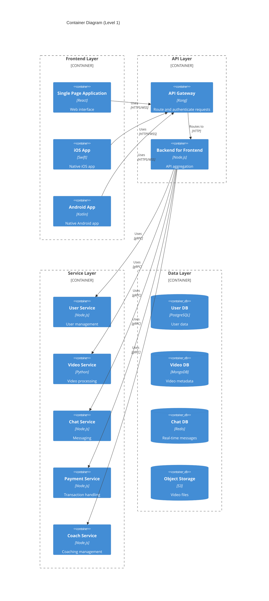

## 2.2 Component Details

### 2.2.1 Frontend Components

| Component | Technology | Purpose | Scaling Strategy |
|-----------|------------|---------|------------------|
| Web App | React, TypeScript | Progressive web interface | Horizontal scaling via CDN |
| iOS App | Swift, SwiftUI | Native iOS experience | N/A - Client-side |
| Android App | Kotlin | Native Android experience | N/A - Client-side |

### 2.2.2 Backend Services

| Service | Technology | Responsibility | Data Store |
|---------|------------|----------------|------------|
| User Service | Node.js, Express | User management, authentication | PostgreSQL |
| Video Service | Python, FastAPI | Video processing, analysis | MongoDB, S3 |
| Chat Service | Node.js, Socket.io | Real-time messaging | Redis |
| Payment Service | Node.js, Express | Transaction processing | PostgreSQL |
| Coach Service | Node.js, Express | Coach profiles, matching | PostgreSQL |

## 2.3 Technical Decisions

### 2.3.1 Architecture Patterns

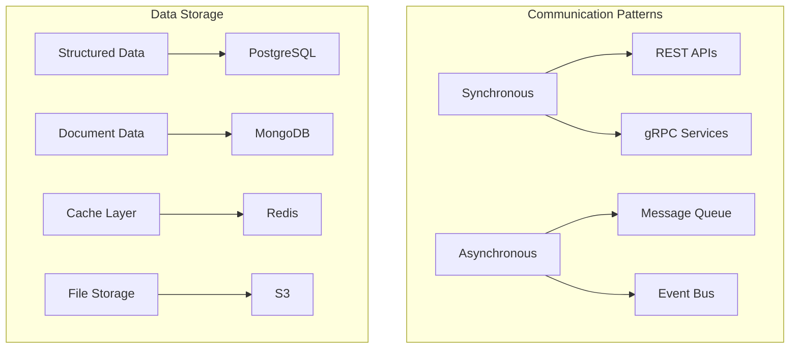

### 2.3.2 Technology Stack Selection

| Layer | Technology | Justification |
|-------|------------|---------------|
| API Gateway | Kong | Enterprise-grade, extensive plugin ecosystem |
| Service Mesh | Istio | Advanced traffic management, security features |
| Message Queue | RabbitMQ | Reliable message delivery, flexible routing |
| Monitoring | Prometheus/Grafana | Industry standard, comprehensive metrics |
| Logging | ELK Stack | Centralized logging, powerful search |

## 2.4 Cross-Cutting Concerns

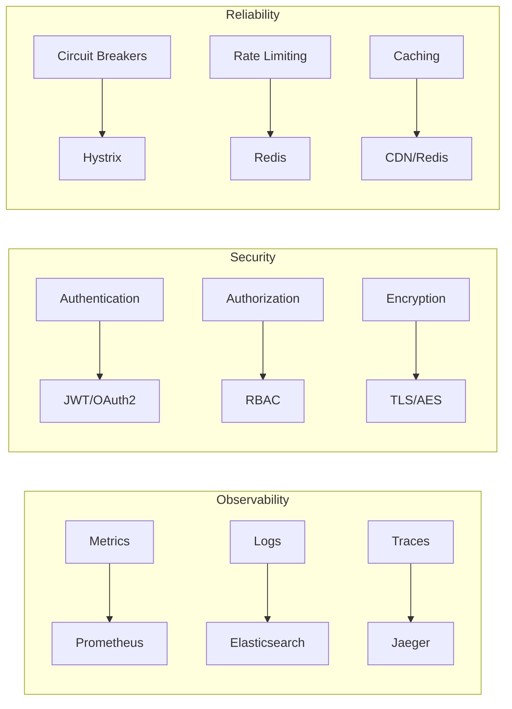

### 2.4.1 Monitoring Strategy

| Aspect | Tool | Metrics |
|--------|------|---------|
| Infrastructure | Prometheus | CPU, Memory, Network |
| Application | APM | Response time, Error rates |
| Business | Custom Metrics | User engagement, Revenue |

### 2.4.2 Disaster Recovery

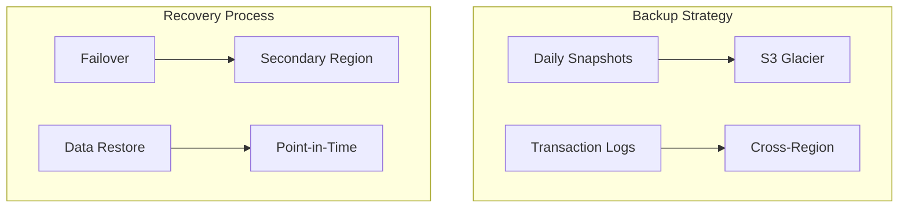

## 2.5 Deployment Architecture

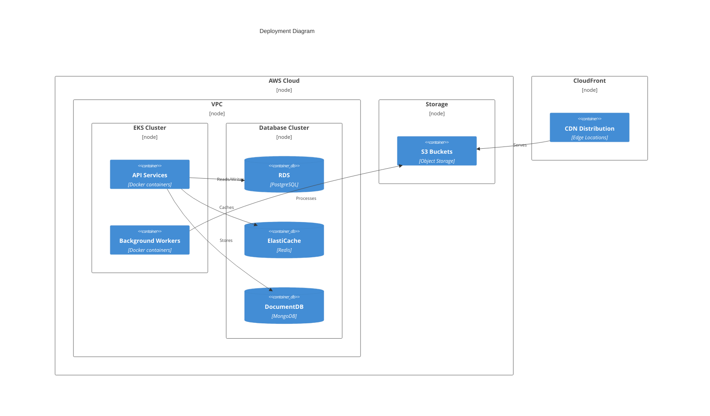

# 3. SYSTEM COMPONENTS ARCHITECTURE

## 3.1 USER INTERFACE DESIGN

### 3.1.1 Design System Specifications

| Component | Specification |
|-----------|--------------|
| Typography | - Primary: SF Pro (iOS), Roboto (Android)<br>- Scale: 12/14/16/20/24/32px<br>- Line heights: 1.5 for body, 1.2 for headings |
| Color Palette | - Primary: #2D5BFF<br>- Secondary: #1A1F36<br>- Success: #00B67A<br>- Error: #FF4D4D<br>- 8 shades of gray (#F8F9FA to #1A1F36) |
| Spacing | - Base unit: 4px<br>- Scale: 4/8/12/16/24/32/48px<br>- Container padding: 16px mobile, 24px desktop |
| Breakpoints | - Mobile: 320-767px<br>- Tablet: 768-1023px<br>- Desktop: 1024px+ |

### 3.1.2 Interface Components

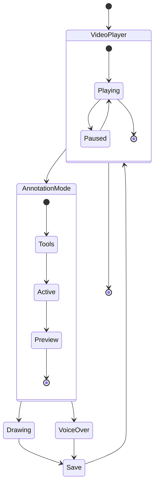

### 3.1.3 Critical User Flows

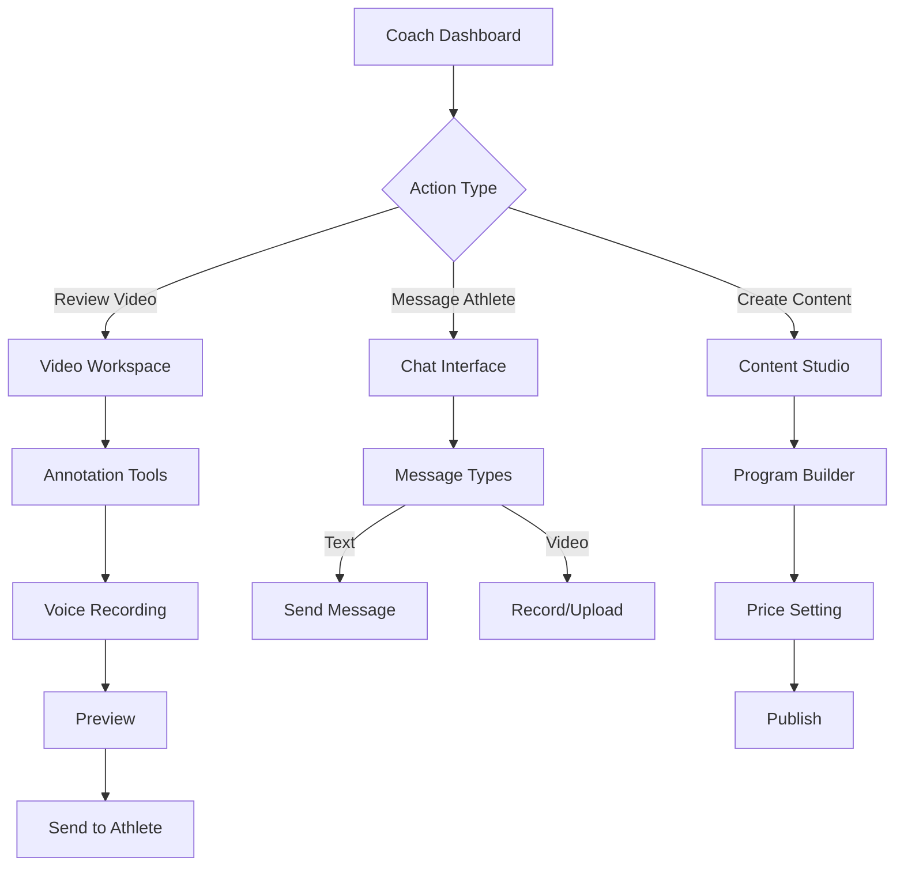

### 3.1.4 Accessibility Requirements

| Category | Requirements |
|----------|--------------|
| Standards | WCAG 2.1 Level AA compliance |
| Color Contrast | Minimum ratio 4.5:1 for normal text, 3:1 for large text |
| Navigation | Keyboard accessible, skip links, ARIA landmarks |
| Media | Captions for videos, alt text for images |
| Interactions | Touch targets minimum 44x44px, error identification |

## 3.2 DATABASE DESIGN

### 3.2.1 Schema Design

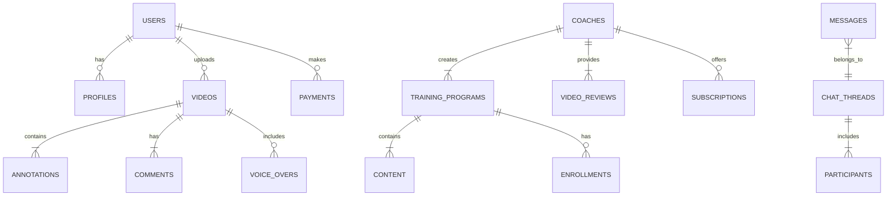

### 3.2.2 Table Structures

| Table | Primary Fields | Indexes | Constraints |
|-------|----------------|---------|-------------|
| users | id, email, password_hash, created_at | email_idx, created_at_idx | email UNIQUE |
| videos | id, user_id, url, status, created_at | user_id_idx, status_idx | user_id FK |
| annotations | id, video_id, timestamp, data | video_id_idx, timestamp_idx | video_id FK |
| training_programs | id, coach_id, title, price | coach_id_idx, title_idx | coach_id FK |
| payments | id, user_id, amount, status | user_id_idx, status_idx | user_id FK |

### 3.2.3 Data Management Strategy

| Aspect | Implementation |
|--------|----------------|
| Partitioning | - Videos partitioned by date<br>- Users partitioned by region<br>- Messages partitioned by thread |
| Caching | - Redis for session data<br>- CDN for video content<br>- Application-level caching for static data |
| Backup | - Daily incremental backups<br>- Weekly full backups<br>- Cross-region replication |
| Retention | - User data: Indefinite<br>- Video data: 90 days after last access<br>- Chat history: 1 year |

## 3.3 API DESIGN

### 3.3.1 API Architecture

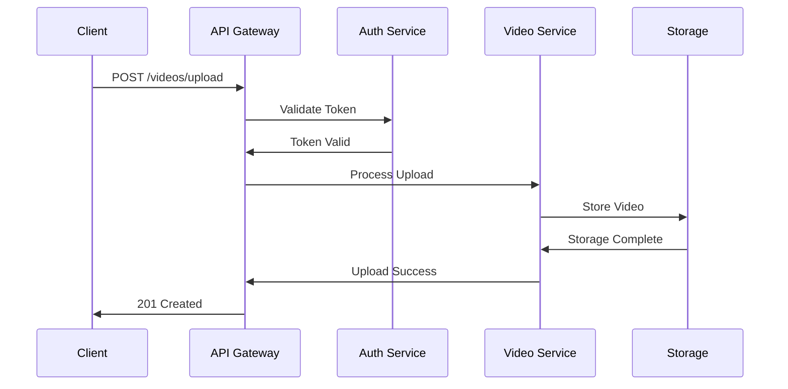

### 3.3.2 API Endpoints

| Endpoint | Method | Purpose | Request Format | Response Format |
|----------|--------|---------|----------------|-----------------|
| /api/v1/videos | POST | Upload video | Multipart form | JSON |
| /api/v1/videos/{id}/annotations | POST | Add annotation | JSON | JSON |
| /api/v1/coaches/{id}/programs | GET | List programs | Query params | JSON |
| /api/v1/messages | POST | Send message | JSON | JSON |
| /api/v1/payments | POST | Process payment | JSON | JSON |

### 3.3.3 Authentication Flow

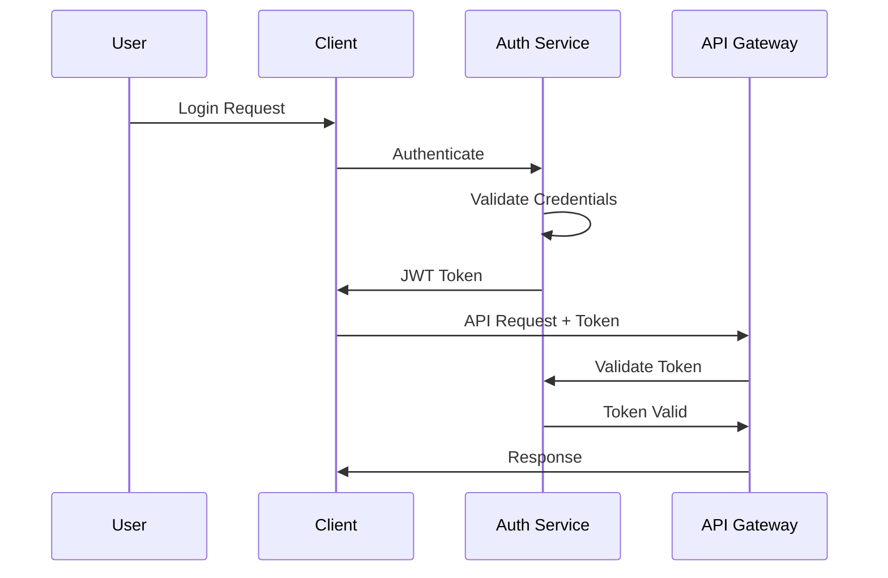

### 3.3.4 Rate Limiting

| API Category | Rate Limit | Window | Burst Allowance |
|--------------|------------|--------|-----------------|
| Public API | 100 | 1 minute | 150 |
| Authenticated API | 1000 | 1 minute | 1500 |
| Video Upload | 10 | 1 hour | 15 |
| Webhook Events | 50 | 1 minute | 75 |

# 4. TECHNOLOGY STACK

## 4.1 PROGRAMMING LANGUAGES

| Platform | Language | Version | Justification |
|----------|----------|---------|---------------|
| Backend Services | Node.js | 18.x LTS | - Excellent ecosystem for real-time features<br>- High performance for video processing<br>- Strong async I/O capabilities |
| iOS App | Swift | 5.9 | - Native performance for video processing<br>- First-class iOS platform integration<br>- Built-in concurrency support |
| Android App | Kotlin | 1.9.x | - Modern Android development features<br>- Coroutines for async operations<br>- Interoperability with Java libraries |
| Web Frontend | TypeScript | 5.2.x | - Type safety for large-scale development<br>- Enhanced IDE support<br>- Better maintainability |
| Video Processing | Python | 3.11.x | - Rich ecosystem for video manipulation<br>- ML/AI capabilities for future features<br>- Efficient video frame processing |

## 4.2 FRAMEWORKS & LIBRARIES

### Backend Frameworks

| Framework | Version | Purpose |
|-----------|---------|---------|
| Express.js | 4.18.x | - RESTful API development<br>- Middleware ecosystem<br>- Route handling |
| Socket.io | 4.7.x | - Real-time messaging<br>- WebSocket management<br>- Client presence detection |
| FastAPI | 0.104.x | - High-performance video processing API<br>- AsyncIO support<br>- OpenAPI documentation |

### Frontend Frameworks

| Framework | Version | Purpose |
|-----------|---------|---------|
| React Native | 0.72.x | - Cross-platform mobile development<br>- Native performance<br>- Code sharing with web |
| Next.js | 14.x | - Server-side rendering<br>- API routes<br>- Static optimization |
| TailwindCSS | 3.3.x | - Utility-first styling<br>- Responsive design<br>- Performance optimization |

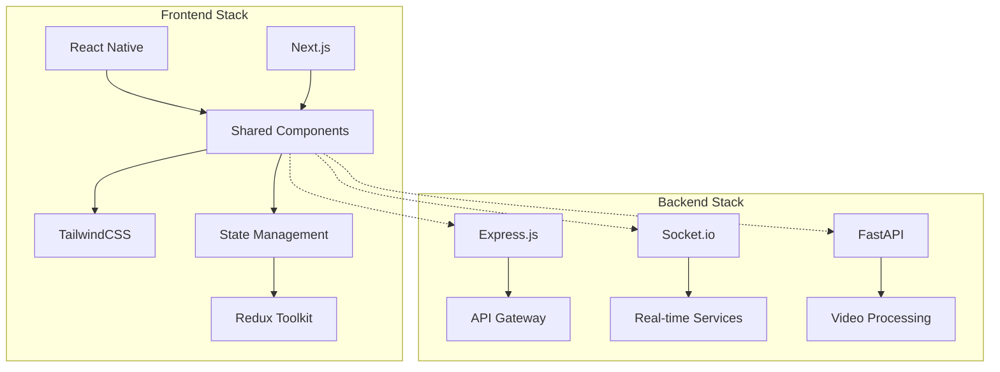

## 4.3 DATABASES & STORAGE

| Type | Technology | Version | Purpose |
|------|------------|---------|---------|
| Primary Database | PostgreSQL | 15.x | - User profiles<br>- Transaction records<br>- Relationship data |
| Document Store | MongoDB | 6.0.x | - Video metadata<br>- Training content<br>- Analytics data |
| Cache Layer | Redis | 7.2.x | - Session management<br>- Real-time data<br>- Rate limiting |
| Object Storage | AWS S3 | - | - Video storage<br>- Training materials<br>- User uploads |
| Search Engine | Elasticsearch | 8.x | - Coach discovery<br>- Content search<br>- Analytics |

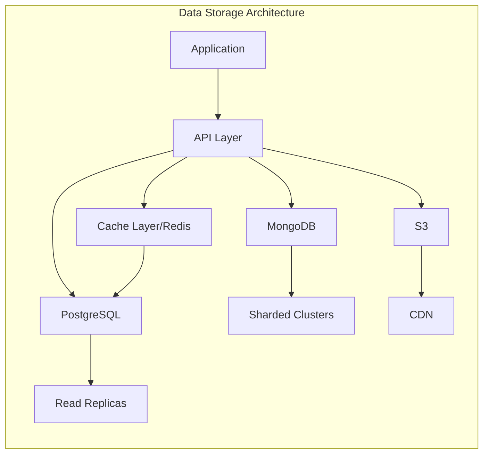

## 4.4 THIRD-PARTY SERVICES

| Service | Purpose | Integration Method |
|---------|---------|-------------------|
| Auth0 | - User authentication<br>- Social login<br>- MFA | REST API / SDK |
| Stripe | - Payment processing<br>- Subscription management<br>- Payout handling | REST API / Webhooks |
| AWS | - Infrastructure hosting<br>- Content delivery<br>- Scaling services | SDK / CloudFormation |
| Sentry | - Error tracking<br>- Performance monitoring<br>- Crash reporting | SDK / API |
| SendGrid | - Email notifications<br>- Marketing communications<br>- Transactional emails | REST API |

## 4.5 DEVELOPMENT & DEPLOYMENT

### Development Tools

| Category | Tool | Version | Purpose |
|----------|------|---------|---------|
| IDE | VS Code | Latest | Primary development environment |
| API Testing | Postman | Latest | API development and testing |
| Version Control | Git | 2.x | Source code management |
| Package Management | npm/yarn | Latest | Dependency management |

### Deployment Pipeline

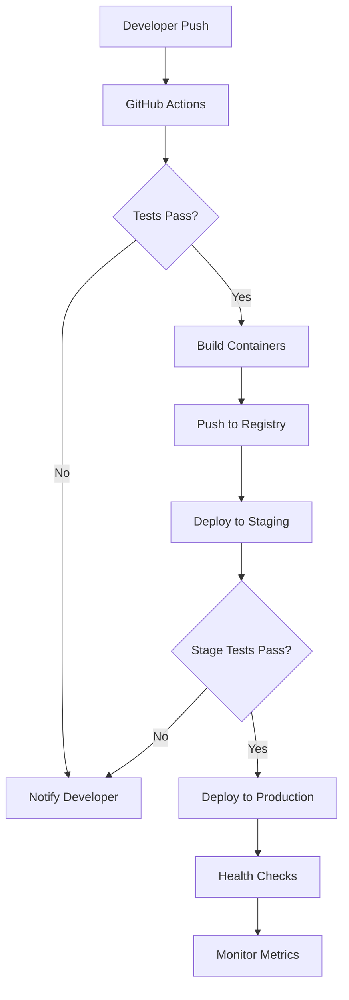

### Infrastructure

| Component | Technology | Configuration |
|-----------|------------|---------------|
| Containers | Docker | 24.x |
| Orchestration | Kubernetes | 1.27.x |
| Service Mesh | Istio | 1.19.x |
| IaC | Terraform | 1.6.x |
| Monitoring | Prometheus/Grafana | Latest |

# 5. SYSTEM DESIGN

## 5.1 USER INTERFACE DESIGN

### 5.1.1 Mobile Application Layout

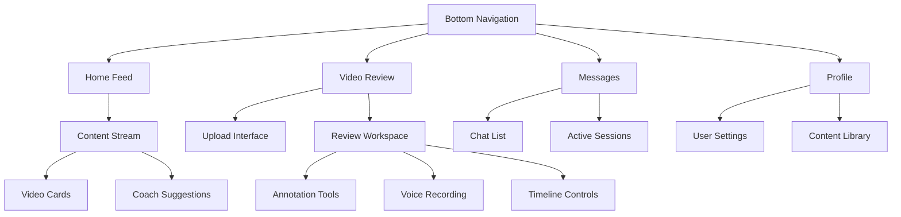

### 5.1.2 Key Interface Components

| Component | Description | Interactions |
|-----------|-------------|--------------|
| Video Review Workspace | Split-screen interface with original video and annotation canvas | - Pinch to zoom<br>- Double tap to pause<br>- Long press for tool selection |
| Annotation Toolbar | Floating toolbar with drawing tools and controls | - Tool selection<br>- Color picker<br>- Stroke width adjustment |
| Voice Recording Controls | Overlay controls for audio recording | - Tap to record<br>- Swipe to cancel<br>- Hold to pause |
| Chat Interface | Threaded messaging with video thumbnail previews | - Swipe to reply<br>- Long press for actions<br>- Pull to refresh |

### 5.1.3 Responsive Breakpoints

| Device | Width | Layout Adjustments |
|--------|-------|-------------------|
| Mobile Portrait | 320-767px | Single column, bottom navigation |
| Mobile Landscape | 568-812px | Two-column split for video workspace |
| Tablet | 768-1023px | Multi-column layout, side navigation |
| Desktop | 1024px+ | Full workspace with floating panels |

## 5.2 DATABASE DESIGN

### 5.2.1 Schema Overview

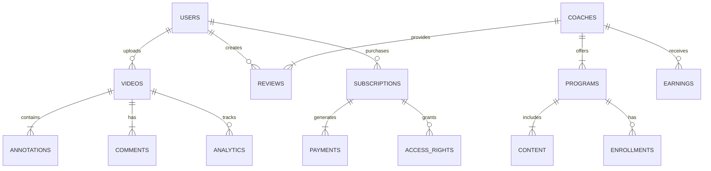

### 5.2.2 Table Structures

| Table | Primary Fields | Indexes | Relationships |
|-------|----------------|---------|---------------|
| users | id, email, role, status | email_idx, role_idx | videos, reviews, subscriptions |
| videos | id, user_id, url, status | user_id_idx, status_idx | annotations, comments |
| annotations | id, video_id, timestamp, data | video_id_idx, timestamp_idx | videos |
| programs | id, coach_id, title, price | coach_id_idx, title_idx | content, enrollments |
| payments | id, subscription_id, amount | subscription_id_idx | subscriptions |

### 5.2.3 Sharding Strategy

| Data Type | Sharding Key | Distribution |
|-----------|--------------|--------------|
| Videos | user_id | Geographic regions |
| Messages | thread_id | Time-based partitions |
| Analytics | timestamp | Monthly partitions |
| User Data | user_id | Regional clusters |

## 5.3 API DESIGN

### 5.3.1 RESTful Endpoints

| Endpoint | Method | Purpose | Request/Response Format |
|----------|--------|---------|------------------------|
| /api/v1/videos | POST | Upload video | Multipart form / JSON |
| /api/v1/videos/{id}/annotations | POST | Add annotation | JSON / JSON |
| /api/v1/reviews | GET | List reviews | Query params / JSON |
| /api/v1/coaches/{id}/programs | GET | List programs | Query params / JSON |
| /api/v1/subscriptions | POST | Create subscription | JSON / JSON |

### 5.3.2 WebSocket Events

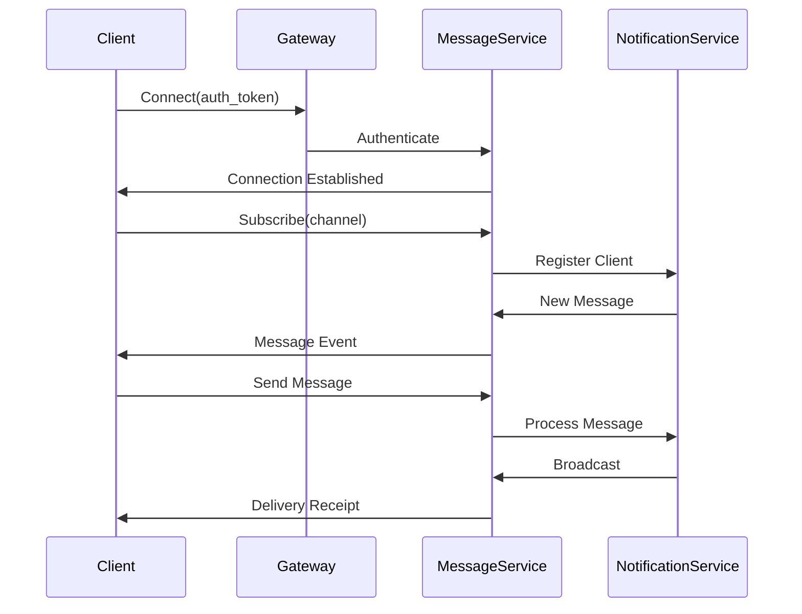

### 5.3.3 API Authentication Flow

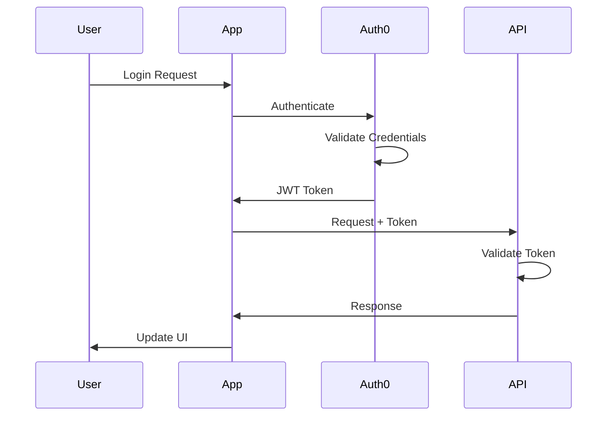

### 5.3.4 Rate Limiting

| API Category | Rate Limit | Window | Burst Allowance |
|--------------|------------|--------|-----------------|
| Public API | 100 | 1 minute | 150 |
| Authenticated API | 1000 | 1 minute | 1500 |
| Video Upload | 10 | 1 hour | 15 |
| Analytics | 500 | 1 minute | 750 |

### 5.3.5 Error Handling

| Error Category | HTTP Status | Response Format |
|----------------|-------------|-----------------|
| Authentication | 401 | `{"error": "unauthorized", "message": "Invalid token"}` |
| Authorization | 403 | `{"error": "forbidden", "message": "Insufficient permissions"}` |
| Validation | 422 | `{"error": "validation_failed", "fields": {...}}` |
| Rate Limit | 429 | `{"error": "rate_limit_exceeded", "retry_after": 60}` |

# 6. USER INTERFACE DESIGN

## 6.1 Design System

| Element | Specification |
|---------|--------------|
| Typography | Primary: SF Pro (iOS), Roboto (Android) |
| Colors | Primary: #2D5BFF, Secondary: #1A1F36, Success: #00B67A, Error: #FF4D4D |
| Spacing | Base unit: 4px, Scale: 4/8/12/16/24/32/48px |
| Breakpoints | Mobile: 320-767px, Tablet: 768-1023px, Desktop: 1024px+ |

## 6.2 Core Screens

### 6.2.1 Coach Dashboard

```
+--------------------------------------------------+
| [@] Coach Name            [!]3  [=]               |
+--------------------------------------------------+
| [#] Dashboard                                     |
+--------------------------------------------------+
| Active Students (12)      Revenue [$]2,450        |
|                                                   |
| +----------------+  +----------------------+       |
| | Pending Reviews|  | Recent Activity     |       |
| | [!] 8 new     |  | [@] John S. - 2m    |       |
| +----------------+  | [@] Sarah M. - 15m  |       |
|                    +----------------------+       |
|                                                   |
| [+] Create Program   [^] Upload Content           |
+--------------------------------------------------+
| Quick Actions:                                    |
| [Review Video] [Message] [Create Post]            |
+--------------------------------------------------+
```

### 6.2.2 Video Analysis Workspace

```
+--------------------------------------------------+
| Video Review - John's Golf Swing                  |
+--------------------------------------------------+
|  +-------------------+  +-------------------+     |
|  | Original Video    |  | Annotated View   |     |
|  |                   |  |    [Drawing Tools]|     |
|  |    [Play/Pause]   |  |    [Color Pick]  |     |
|  |    [<<] [>>]      |  |    [Clear All]   |     |
|  +-------------------+  +-------------------+     |
|                                                  |
| Tools:                                           |
| (•) Draw  ( ) Line  ( ) Arrow  ( ) Shape        |
|                                                  |
| [Record Voice-over]  [====] 00:45               |
|                                                  |
| [Save & Send] [Discard] [Preview]               |
+--------------------------------------------------+
```

### 6.2.3 Athlete Mobile View

```
+------------------+
| [@] Profile  [=] |
+------------------+
| My Training      |
| +---------------+|
| |Latest Review  ||
| |[>] Watch Now  ||
| +---------------+|
|                  |
| Messages [!]2    |
| +---------------+|
| |Coach Mike     ||
| |New feedback...||
| +---------------+|
|                  |
| [+] Upload Video |
| [#] Programs     |
| [$] Payments     |
+------------------+
```

### 6.2.4 Chat Interface

```
+--------------------------------------------------+
| Chat with Sarah M.                         [x]    |
+--------------------------------------------------+
| +--------------------------------------------+   |
| | Today                                      |   |
| |                                           |   |
| | [@] Here's my practice video              |   |
| | [Video Thumbnail]                         |   |
| |                            12:30 PM       |   |
| |                                           |   |
| | Great form! I've added some              |   |
| | annotations for you to review.            |   |
| | [Video Response]                          |   |
| |                            12:45 PM       |   |
| +--------------------------------------------+   |
|                                                  |
| [...]                                           |
| [Send] [^] [Camera]                             |
+--------------------------------------------------+
```

## 6.3 Component Library

### 6.3.1 Navigation Elements
```
Primary Navigation:
[#] Dashboard
[*] Favorites
[@] Profile
[=] Settings
[!] Notifications
[$] Payments

Secondary Navigation:
[<] Back
[>] Forward
[^] Upload
[v] More Options
```

### 6.3.2 Action Components
```
Buttons:
[Primary Action]
[Secondary Action]
[Destructive Action]

Input Fields:
Username: [..................]
Password: [••••••••••••••••]
Search:   [...] [Search]

Selection:
[v] Dropdown Menu
( ) Radio Option
[ ] Checkbox Option
```

### 6.3.3 Status Indicators
```
Progress:
Upload: [====----] 45%
Loading: [••••    ]

States:
[*] Active
[!] Warning
[x] Error
[✓] Success
```

## 6.4 Interaction Patterns

| Pattern | Implementation |
|---------|---------------|
| Video Upload | Single tap to record, hold to pause, double tap to stop |
| Annotation | Touch and drag for drawing, pinch to zoom, two-finger rotate |
| Navigation | Swipe between screens, pull to refresh, long press for options |
| Voice-over | Hold to record, release to pause, double tap to finish |

## 6.5 Accessibility Requirements

| Feature | Implementation |
|---------|---------------|
| Color Contrast | Minimum 4.5:1 ratio for text |
| Touch Targets | Minimum 44x44px tap areas |
| Voice Control | Full navigation support |
| Screen Readers | ARIA labels and landmarks |
| Text Scaling | Support up to 200% zoom |

# 7. SECURITY CONSIDERATIONS

## 7.1 AUTHENTICATION AND AUTHORIZATION

### 7.1.1 Authentication Methods

| Method | Implementation | Use Case |
|--------|----------------|-----------|
| Email/Password | Auth0 with bcrypt hashing | Primary authentication |
| Social Login | OAuth 2.0 via Auth0 | Alternative sign-in |
| Biometric | Native iOS/Android APIs | Mobile app authentication |
| MFA | TOTP via Auth0 | Required for coaches and admins |
| API Keys | JWT with RS256 signing | Service-to-service auth |

### 7.1.2 Authorization Model

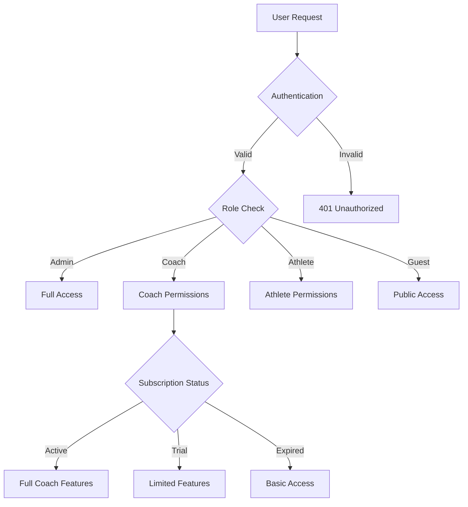

### 7.1.3 Permission Matrix

| Role | Video Access | Messaging | Analytics | Admin Tools |
|------|--------------|-----------|-----------|-------------|
| Admin | Full | Full | Full | Full |
| Coach (Premium) | Own + Students | Unlimited | Own Data | None |
| Coach (Basic) | Own + Limited | Limited | Basic | None |
| Athlete (Paid) | Own + Purchased | Direct to Coach | Own Progress | None |
| Athlete (Free) | Own Only | None | None | None |

## 7.2 DATA SECURITY

### 7.2.1 Encryption Standards

| Data Type | At Rest | In Transit | Key Management |
|-----------|----------|------------|----------------|
| User Credentials | AES-256 | TLS 1.3 | AWS KMS |
| Payment Info | PCI DSS Compliant | TLS 1.3 | Stripe |
| Video Content | AES-256 | TLS 1.3 | AWS KMS |
| Messages | AES-256 | WSS + TLS 1.3 | Custom KMS |

### 7.2.2 Data Classification

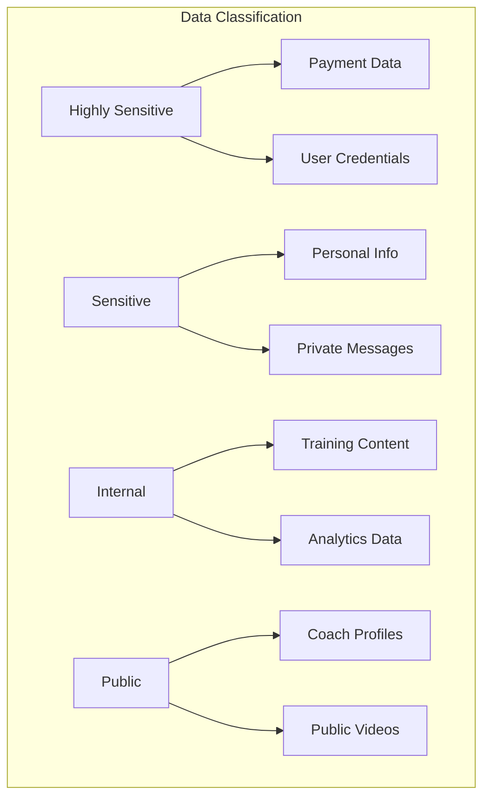

### 7.2.3 Data Protection Measures

| Protection Type | Implementation | Monitoring |
|----------------|----------------|------------|
| Access Control | RBAC + ABAC | Audit logs |
| Data Masking | PII redaction | Automated scanning |
| Backup Encryption | AES-256 | Integrity checks |
| DLP | Content scanning | Real-time alerts |

## 7.3 SECURITY PROTOCOLS

### 7.3.1 Network Security

```mermaid
flowchart LR
    subgraph "Security Layers"
        A[WAF] --> B[Load Balancer]
        B --> C[API Gateway]
        C --> D[Application]
        D --> E[Database]
        
        F[DDoS Protection] --> A
        G[IDS/IPS] --> B
        H[VPC] --> D
    end
```

### 7.3.2 Security Monitoring

| Component | Tool | Metrics |
|-----------|------|---------|
| SIEM | ELK Stack | Security events, access logs |
| Intrusion Detection | Snort | Network anomalies |
| Vulnerability Scanning | Nessus | Weekly scans |
| Penetration Testing | Manual + Automated | Quarterly |

### 7.3.3 Incident Response

```mermaid
stateDiagram-v2
    [*] --> Detection
    Detection --> Analysis
    Analysis --> Containment
    Containment --> Eradication
    Eradication --> Recovery
    Recovery --> PostIncident
    PostIncident --> [*]
    
    state Detection {
        [*] --> Alert
        Alert --> Triage
        Triage --> [*]
    }
    
    state Containment {
        [*] --> IsolateSystem
        IsolateSystem --> SecureEvidence
        SecureEvidence --> [*]
    }
```

### 7.3.4 Compliance Controls

| Requirement | Implementation | Validation |
|-------------|----------------|------------|
| GDPR | Data privacy controls | Annual audit |
| PCI DSS | Stripe integration | Quarterly scan |
| COPPA | Age verification | Continuous monitoring |
| SOC 2 | Security controls | Annual certification |

### 7.3.5 Security Updates

| Component | Update Frequency | Process |
|-----------|-----------------|---------|
| OS Patches | Monthly | Automated deployment |
| Dependencies | Weekly | Automated scanning |
| Security Policies | Quarterly | Manual review |
| SSL Certificates | Auto-renewal | Let's Encrypt |

# 8. INFRASTRUCTURE

## 8.1 DEPLOYMENT ENVIRONMENT

The Video Coaching Platform utilizes a cloud-native architecture with multi-region deployment for optimal performance and reliability.

| Environment | Purpose | Configuration |
|-------------|---------|---------------|
| Development | Feature development and testing | Single region, scaled-down resources |
| Staging | Pre-production testing and validation | Multi-region, production-like setup |
| Production | Live system serving end users | Multi-region, full redundancy |

```mermaid
flowchart TD
    subgraph "Production Environment"
        A[Primary Region] --> B[Load Balancer]
        C[Secondary Region] --> B
        
        B --> D[CDN Edge Locations]
        D --> E[End Users]
        
        subgraph "Region Components"
            F[Kubernetes Cluster]
            G[Database Cluster]
            H[Cache Layer]
            I[Storage Layer]
        end
        
        A --> F & G & H & I
        C --> F & G & H & I
    end
```

## 8.2 CLOUD SERVICES

| Service | Provider | Purpose | Justification |
|---------|----------|---------|---------------|
| Compute | AWS EKS | Container orchestration | Native Kubernetes support, mature ecosystem |
| Storage | AWS S3 | Video and asset storage | Cost-effective, global distribution |
| CDN | CloudFront | Content delivery | Low latency, edge computing capabilities |
| Database | AWS RDS | Relational data storage | Managed service, automatic failover |
| Cache | ElastiCache | Session and data caching | Redis compatibility, high availability |
| Search | OpenSearch | Content and user search | Elasticsearch API compatibility |

### Regional Distribution

```mermaid
graph TD
    subgraph "Global Infrastructure"
        A[US East] --> B[Global Load Balancer]
        C[US West] --> B
        D[EU Central] --> B
        E[Asia Pacific] --> B
        
        B --> F[CloudFront CDN]
        F --> G[End Users]
        
        subgraph "Regional Services"
            H[EKS Cluster]
            I[RDS Instance]
            J[ElastiCache]
            K[S3 Bucket]
        end
        
        A & C & D & E --> H & I & J & K
    end
```

## 8.3 CONTAINERIZATION

### Container Strategy

| Component | Base Image | Resource Limits |
|-----------|------------|-----------------|
| API Services | node:18-alpine | CPU: 2 cores, Memory: 4GB |
| Video Processing | python:3.11-slim | CPU: 4 cores, Memory: 8GB |
| Web Server | nginx:alpine | CPU: 1 core, Memory: 2GB |
| Background Workers | node:18-alpine | CPU: 2 cores, Memory: 4GB |

### Docker Configuration

```mermaid
graph LR
    subgraph "Container Architecture"
        A[Base Images] --> B[Build Stage]
        B --> C[Production Image]
        
        C --> D[API Container]
        C --> E[Worker Container]
        C --> F[Web Container]
        
        D & E & F --> G[Container Registry]
        G --> H[Kubernetes Deployment]
    end
```

## 8.4 ORCHESTRATION

### Kubernetes Architecture

| Component | Purpose | Configuration |
|-----------|---------|---------------|
| Control Plane | Cluster management | Multi-master setup |
| Worker Nodes | Application workloads | Auto-scaling groups |
| Service Mesh | Inter-service communication | Istio implementation |
| Ingress | External traffic routing | nginx-ingress |

```mermaid
flowchart TD
    subgraph "Kubernetes Cluster"
        A[Ingress Controller] --> B[Service Mesh]
        B --> C[Application Pods]
        
        C --> D[API Services]
        C --> E[Video Processing]
        C --> F[Background Workers]
        
        G[Auto Scaler] --> C
        H[Config Maps] --> C
        I[Secrets] --> C
    end
```

## 8.5 CI/CD PIPELINE

### Pipeline Stages

```mermaid
flowchart LR
    subgraph "CI/CD Workflow"
        A[Code Push] --> B[Build]
        B --> C[Test]
        C --> D[Security Scan]
        D --> E[Deploy to Staging]
        E --> F[Integration Tests]
        F --> G[Deploy to Production]
        G --> H[Health Checks]
        
        I[Rollback] --> A
        H -->|Failure| I
    end
```

### Deployment Strategy

| Stage | Tool | Configuration |
|-------|------|---------------|
| Source Control | GitHub | Branch protection, required reviews |
| CI Platform | GitHub Actions | Matrix builds, caching |
| Container Registry | ECR | Vulnerability scanning |
| Infrastructure as Code | Terraform | State in S3, DynamoDB locking |
| Monitoring | Prometheus/Grafana | Custom dashboards |
| Alerting | PagerDuty | On-call rotation |

### Deployment Process

```mermaid
sequenceDiagram
    participant Dev as Developer
    participant GH as GitHub
    participant CI as GitHub Actions
    participant Reg as ECR
    participant K8s as Kubernetes
    
    Dev->>GH: Push Code
    GH->>CI: Trigger Pipeline
    CI->>CI: Run Tests
    CI->>CI: Build Container
    CI->>Reg: Push Image
    CI->>K8s: Update Deployment
    K8s->>K8s: Rolling Update
    K8s->>CI: Deployment Status
    CI->>GH: Update Status
```

# 8. APPENDICES

## 8.1 ADDITIONAL TECHNICAL INFORMATION

### 8.1.1 Video Processing Pipeline

```mermaid
flowchart TD
    A[Video Upload] --> B[Format Validation]
    B --> C[Virus Scan]
    C --> D[Initial Processing]
    D --> E{Format Check}
    E -->|Supported| F[Direct Processing]
    E -->|Unsupported| G[Format Conversion]
    G --> F
    F --> H[Compression]
    H --> I[Generate Variants]
    I --> J[CDN Distribution]
    
    subgraph "Variant Generation"
        I --> K[HD - 1080p]
        I --> L[SD - 720p]
        I --> M[Mobile - 480p]
        I --> N[Thumbnail]
    end
```

### 8.1.2 Background Check Integration

| Provider | Integration Method | Verification Types |
|----------|-------------------|-------------------|
| Sterling | REST API | Identity verification, Criminal record |
| Checkr | Webhook Events | SSN verification, Address history |
| HireRight | OAuth 2.0 | Professional certification, Education |

### 8.1.3 Analytics Implementation

| Metric Type | Collection Method | Storage |
|-------------|------------------|---------|
| User Engagement | Client-side events | MongoDB |
| Video Performance | Server-side logging | Elasticsearch |
| Revenue Analytics | Transaction processing | PostgreSQL |
| Platform Health | System metrics | Prometheus |

## 8.2 GLOSSARY

| Term | Definition |
|------|------------|
| Annotation Layer | Transparent overlay on video content where drawings and markups are rendered |
| Codec | Software for compressing/decompressing digital video |
| Content Locker | Secure storage area for athlete's purchased training materials |
| Edge Location | CDN server positioned geographically close to end users |
| Frame Extraction | Process of capturing still images from video content |
| Hot Standby | Backup system running continuously, ready to take over immediately |
| Microservices | Architecture pattern where application is built as independent services |
| Rate Limiting | Controlling the number of requests a user can make in a given timeframe |
| Sharding | Database partitioning technique for handling large datasets |
| Voice-over | Audio recording synchronized with video playback |

## 8.3 ACRONYMS

| Acronym | Full Form |
|---------|-----------|
| ABAC | Attribute-Based Access Control |
| API | Application Programming Interface |
| CDN | Content Delivery Network |
| DLP | Data Loss Prevention |
| ELK | Elasticsearch, Logstash, Kibana |
| GDPR | General Data Protection Regulation |
| JWT | JSON Web Token |
| KMS | Key Management Service |
| RBAC | Role-Based Access Control |
| REST | Representational State Transfer |
| S3 | Simple Storage Service |
| SOC | System and Organization Controls |
| TLS | Transport Layer Security |
| VPC | Virtual Private Cloud |
| WCAG | Web Content Accessibility Guidelines |
| WSS | WebSocket Secure |

## 8.4 REVISION HISTORY

```mermaid
gitGraph
    commit id: "Initial Draft"
    commit id: "Add System Architecture"
    branch feature/auth
    commit id: "Auth Implementation"
    checkout main
    merge feature/auth
    commit id: "Add Database Design"
    branch feature/video
    commit id: "Video Processing"
    checkout main
    merge feature/video
    commit id: "Final Review"
```

## 8.5 DEPENDENCIES

| Category | Component | Version | Purpose |
|----------|-----------|---------|----------|
| Frontend | React Native | 0.72.x | Mobile app development |
| | Next.js | 14.x | Web application |
| | TailwindCSS | 3.3.x | Styling |
| Backend | Node.js | 18.x LTS | API services |
| | Python | 3.11.x | Video processing |
| | FastAPI | 0.104.x | Video API |
| Database | PostgreSQL | 15.x | Primary database |
| | MongoDB | 6.0.x | Video metadata |
| | Redis | 7.2.x | Caching |
| Infrastructure | Docker | 24.x | Containerization |
| | Kubernetes | 1.27.x | Orchestration |
| | Terraform | 1.6.x | Infrastructure as Code |