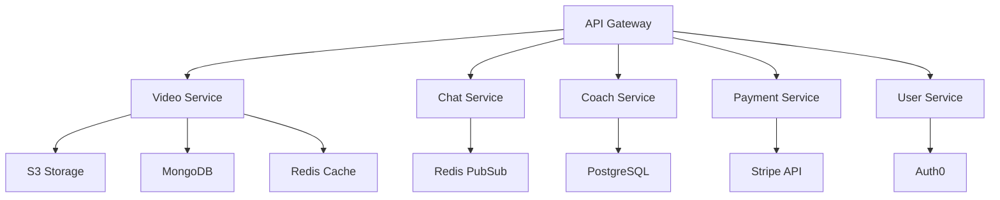

# Video Coaching Platform - Backend Services

## Overview

Enterprise-grade microservices architecture for the Video Coaching Platform, providing secure video processing, real-time annotations, and coaching management capabilities.

### Key Features

- Secure video upload and processing pipeline
- Real-time video annotations with drawing and voice-over support
- CDN integration for global content delivery
- Comprehensive monitoring and observability
- Production-grade security measures

## Architecture

The backend is built on a microservices architecture using the following core services:

- API Gateway (Node.js/Express)
- Video Service (Python/FastAPI)
- Chat Service (Node.js/Socket.io)
- Coach Service (Node.js/Express)
- Payment Service (Node.js/Express)
- User Service (Node.js/Express)

### System Components



## Prerequisites

### Runtime Requirements

- Node.js >= 18.0.0
- Python >= 3.11
- Docker >= 24.0.0
- Kubernetes >= 1.27.x

### Infrastructure Dependencies

- AWS Account with S3 access
- MongoDB >= 6.0
- Redis >= 7.2
- PostgreSQL >= 15.0

### Development Tools

- npm >= 9.0.0
- Python Poetry
- Docker Compose
- kubectl

## Development Setup

1. Install dependencies:
```bash
npm install
npm run bootstrap
```

2. Configure environment:
```bash
cp .env.example .env
# Edit .env with your configuration
```

3. Start development services:
```bash
docker-compose up -d
npm run dev
```

4. Run tests:
```bash
npm run test
```

## Production Deployment

### Container Configuration

Services are containerized with optimized configurations:

```bash
# Build production images
docker-compose -f docker-compose.prod.yml build

# Deploy to Kubernetes
kubectl apply -f k8s/
```

### Scaling Guidelines

- API Gateway: Scale based on request rate
- Video Service: Scale based on processing queue
- Chat Service: Scale based on active connections
- Database Services: Use managed services with auto-scaling

### Resource Requirements

| Service | CPU | Memory | Storage |
|---------|-----|---------|----------|
| API Gateway | 2 cores | 4GB | - |
| Video Service | 4 cores | 8GB | 100GB |
| Chat Service | 2 cores | 4GB | - |
| MongoDB | 4 cores | 8GB | 500GB |
| Redis | 2 cores | 4GB | 50GB |

## Monitoring & Observability

### Metrics Collection

- Prometheus metrics exposed on `/metrics`
- Custom video processing metrics
- Business KPIs tracking

### Logging

Structured JSON logging with:

- Correlation IDs
- Service context
- Performance metrics
- Error tracking

### Health Checks

- Liveness probe: `/health`
- Readiness probe: `/ready`
- Deep health checks: `/health/deep`

## Security

### Authentication & Authorization

- JWT-based authentication
- Role-based access control (RBAC)
- API key management for service-to-service communication

### Data Protection

- TLS 1.3 for all communications
- AES-256 encryption for stored content
- PII data encryption at rest

### Security Scanning

- Container vulnerability scanning
- Dependency auditing
- Regular penetration testing

## API Documentation

- OpenAPI/Swagger documentation available at `/api/docs`
- Postman collection in `docs/postman`
- API versioning via URL path (/api/v1)

## Maintenance

### Backup Procedures

- Database: Daily automated backups
- Video content: Cross-region replication
- Configuration: Version controlled

### Update Procedures

1. Deploy to staging environment
2. Run integration tests
3. Perform canary deployment
4. Monitor metrics
5. Complete rollout

### Disaster Recovery

- Multi-region deployment
- Automated failover
- Regular DR testing

## Support

- Technical issues: Create GitHub issue
- Security concerns: security@videocoach.com
- Production incidents: ops@videocoach.com

## License

UNLICENSED - Copyright © 2023 Video Coach Platform Team