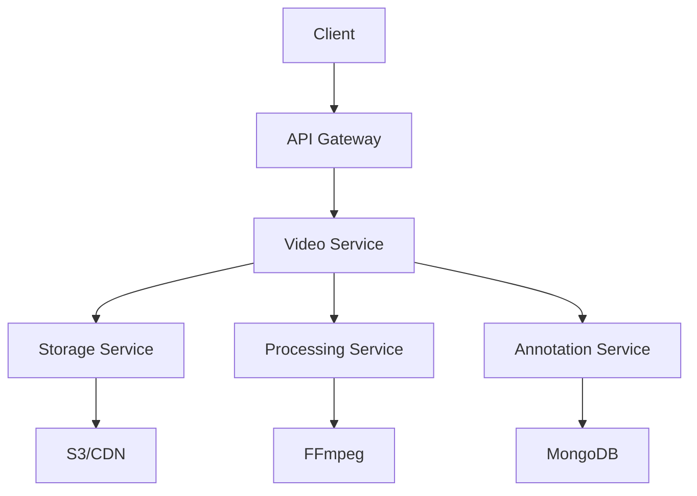

# Video Processing Service

A high-performance video processing service that handles video uploads, annotations, processing and analysis using Python and FastAPI.

## Overview

The Video Processing Service is a critical component of the Video Coaching Platform that provides:

- Secure video upload and storage
- Real-time video annotation capabilities 
- Voice-over recording and synchronization
- Automated video processing and optimization
- Multi-quality variant generation
- Content delivery via CDN

## Features

### Video Management
- Secure file upload with validation and virus scanning
- Format validation and transcoding
- Automatic quality variant generation (HD/SD/Mobile)
- CDN integration for optimized delivery
- Processing status monitoring

### Annotation System
- Real-time drawing annotations
- Voice-over recording and synchronization
- Timestamp-based annotations
- Annotation persistence and retrieval
- Multi-user annotation support

### Security
- JWT-based authentication
- Role-based access control
- Input validation and sanitization
- Secure file handling
- Rate limiting and DDoS protection

### Monitoring
- Prometheus metrics collection
- APM integration with Elastic
- Structured logging
- Performance monitoring
- Error tracking and alerting

## Architecture

### Component Overview


### Key Components
- FastAPI application server
- MongoDB for annotation storage
- Redis for caching and rate limiting
- S3 for video storage
- CloudFront for content delivery
- FFmpeg for video processing

## Dependencies

### Core Dependencies
- Python 3.11
- FastAPI 0.104.0
- OpenCV 4.8.1
- FFmpeg-python 0.2.0
- MongoDB 4.5.0
- Redis 5.0.1

### Development Dependencies
- pytest 7.4.0
- black 23.9.1
- mypy 1.5.1
- flake8 6.1.0

## Setup

### Prerequisites
1. Install Python 3.11
2. Install FFmpeg
3. Install MongoDB
4. Install Redis
5. Configure AWS credentials

### Installation
```bash
# Create virtual environment
python -m venv venv
source venv/bin/activate

# Install dependencies
pip install -r requirements.txt

# Configure environment
cp .env.example .env
# Edit .env with your configuration
```

### Development Setup
```bash
# Install development dependencies
pip install -r requirements-dev.txt

# Setup pre-commit hooks
pre-commit install

# Run tests
pytest

# Run linting
black src tests
flake8 src tests
mypy src
```

## API Documentation

### Video Endpoints

#### Upload Video
```http
POST /api/v1/videos
Content-Type: multipart/form-data

file: <video_file>
title: "Training Session"
description: "Front squat technique analysis"
```

#### Get Video Status
```http
GET /api/v1/videos/{video_id}
Authorization: Bearer <token>
```

### Annotation Endpoints

#### Create Drawing Annotation
```http
POST /api/v1/annotations/drawing
Content-Type: application/json

{
  "video_id": "uuid",
  "timestamp": 15.5,
  "drawing_data": {
    "tool_type": "pen",
    "points": [...],
    "color": "#FF0000"
  }
}
```

#### Create Voice-over
```http
POST /api/v1/annotations/voice-over
Content-Type: multipart/form-data

video_id: "uuid"
timestamp: 30.5
audio_file: <audio_file>
```

## Deployment

### Docker Deployment
```bash
# Build image
docker build -t video-service .

# Run container
docker run -p 8000:8000 \
  --env-file .env \
  video-service
```

### Kubernetes Deployment
```bash
# Apply configurations
kubectl apply -f k8s/

# Verify deployment
kubectl get pods -n video-service
```

## Monitoring

### Metrics
- Video processing duration
- Upload/download latency
- Error rates
- Storage operations
- Active processing jobs

### Health Checks
```http
GET /health
GET /ready
```

## Troubleshooting

### Common Issues
1. Video upload failures
   - Check file size limits
   - Verify supported formats
   - Check storage permissions

2. Processing errors
   - Verify FFmpeg installation
   - Check CPU/memory resources
   - Review processing logs

3. Performance issues
   - Monitor resource usage
   - Check Redis cache hit rates
   - Review CDN configuration

## Contributing

1. Fork the repository
2. Create a feature branch
3. Make changes following style guide
4. Add tests
5. Submit pull request

## License

Proprietary - All rights reserved